# YuMatrix Studio Target Architecture

> **Document ID:** YM-ARCH-003  
> **Version:** 2.0.0 (Draft)  
> **Status:** Draft  
> **Owner:** Architecture Team  
> **Last Updated:** 2026-07-02

---

# Executive Summary

YuMatrix Studio is an AI-native desktop automation platform designed for multi-platform content operations, browser automation (RPA), and intelligent workflow orchestration.

Unlike a traditional Electron application, YuMatrix Studio adopts a layered and modular architecture where Electron serves only as the application host. Business capabilities, platform integrations, automation engines, and AI services are implemented as independent modules with clearly defined responsibilities and dependency boundaries.

This document defines the target architecture of the project and serves as the single source of truth for future development, refactoring, and architectural evolution.

All implementation, code review, and refactoring activities MUST comply with this specification.

---

# 1. Vision

## Project Vision

YuMatrix Studio aims to become an AI-powered desktop operating platform for content creators and digital operations teams.

The platform integrates Artificial Intelligence, Browser Automation (RPA), Multi-platform Publishing, and Data Analytics into a unified workflow, enabling users to automate repetitive tasks while maintaining full control over their operational processes.

---

## Core Capabilities

The platform provides the following major capabilities:

- AI-assisted content generation
- Multi-platform publishing
- Browser automation (RPA)
- Multi-account management
- Media processing
- Analytics and reporting
- Workflow orchestration
- Plugin-based platform extensions

---

## Long-term Goals

YuMatrix Studio is designed to evolve beyond a desktop application.

Future deployment targets include:

- Desktop Application (Electron)
- Web Dashboard
- Cloud Worker
- CLI Tools
- Plugin Marketplace
- Team Collaboration Platform

---

# 2. Architecture Goals

The target architecture is designed around the following goals.

| Goal | Description |
|------|-------------|
| Scalability | New modules and platforms can be added without modifying existing architecture. |
| Maintainability | Business logic remains isolated and easy to evolve. |
| Extensibility | Platform integrations follow a unified adapter contract. |
| Testability | Core services and business modules can be tested independently. |
| Stability | Core services remain stable while business modules evolve rapidly. |
| AI Native | AI capabilities are treated as first-class platform services rather than optional features. |

---

# 3. Architecture Principles

Every component of YuMatrix Studio MUST follow these principles.

## 3.1 Business-Oriented Architecture

The system is organized around business capabilities rather than technical frameworks.

Business modules represent user-facing functionality, while technical infrastructure remains hidden beneath the Core layer.

---

## 3.2 Stable Core

The Core layer provides foundational services for the entire platform.

Core services must remain lightweight, reusable, and independent of business logic.

Business code MUST NOT be placed inside `src/core`.

---

## 3.3 Modular Business Design

Every business capability belongs to an independent module.

Each module should:

- Have a single responsibility.
- Own its business data.
- Expose public APIs.
- Hide internal implementation.

---

## 3.4 Plugin-First Platform Integration

Every supported platform (Xiaohongshu, Douyin, Bilibili, etc.) must implement a common adapter interface.

Business modules interact with platform adapters instead of platform-specific implementations.

---

## 3.5 Event-Driven Communication

Modules should communicate through events whenever possible.

Direct module-to-module dependencies should be minimized.

---

## 3.6 AI Native

Artificial Intelligence is a platform capability rather than a feature of individual modules.

All AI providers are managed through AI Hub.

---

# 4. System Context

The following diagram illustrates the logical architecture of YuMatrix Studio.

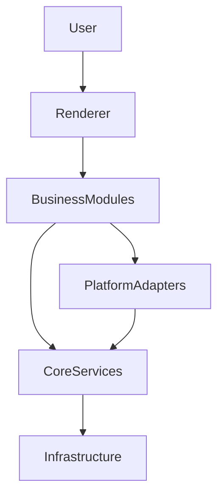

---

## Layer Responsibilities

| Layer | Responsibility |
|--------|----------------|
| Application | Electron lifecycle and process management |
| Renderer | User interface built with React |
| Business Modules | Publish, Account, Analytics, Media, AI Hub |
| Platform Adapters | Xiaohongshu, Douyin, Bilibili and future platforms |
| Core Services | Database, IPC, Logger, Config, Security, Event Bus |
| Infrastructure | SQLite, Playwright, Cloud APIs, File System |

---

# 5. Overall Architecture

The target architecture follows a layered design.

```text
Application
        │
────────┼────────
        │
Business Modules
        │
────────┼────────
        │
Platform Adapters
        │
────────┼────────
        │
Core Services
        │
────────┼────────
        │
Infrastructure
```

Each layer has clearly defined responsibilities and dependency rules.

Dependencies MUST always point downward.

Reverse dependencies are prohibited.

---

## Dependency Direction

✅ Allowed

Application
→ Business Modules

Business Modules
→ Platform Adapters

Business Modules
→ Core Services

Platform Adapters
→ Core Services

Core Services
→ Infrastructure

---

❌ Forbidden

Renderer
→ Database

Renderer
→ Playwright

Platform
→ Platform

Core
→ Business Modules

Business Module
→ Renderer

Circular Dependencies

# 6. Core Services

Core Services represent the stable foundation of YuMatrix Studio.

They provide shared capabilities for all Business Modules and Platform Adapters.

Core MUST NOT contain any business logic.

---

## 6.1 Core Responsibilities

Core is responsible for:

- Data persistence
- IPC communication
- Logging system
- Configuration management
- Event-driven communication
- Security utilities (encryption, fingerprinting)

---

## 6.2 Core Modules

| Module | Responsibility |
|--------|----------------|
| AI | Unified AI routing and provider abstraction |
| Database | Data persistence layer |
| IPC | Cross-process communication |
| Logger | System-wide logging |
| Config | Global configuration management |
| Event Bus | Inter-module event communication |
| Security | Encryption, fingerprint, session isolation |

---

## 6.3 Core Design Rules

Core MUST follow:

- No dependency on Business Modules
- No dependency on Renderer
- No platform-specific logic
- Stateless or infrastructure-bound logic only

Core MUST NOT:

- Implement business workflows
- Call Platform Adapters
- Access UI state

---

## 6.4 Core Interaction Model

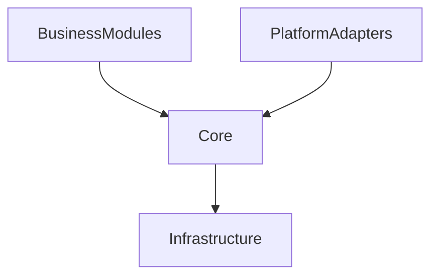

Core acts as a shared foundation layer, not an orchestrator.

---

# 7. Business Modules

Business Modules represent domain-specific capabilities of YuMatrix Studio.

Each module is independent and encapsulates its own business logic, data model, and workflows.

---

## 7.1 Module Design Rules

Each Business Module MUST:

- Own its domain logic
- Expose a public service API
- Avoid direct dependency on other modules
- Communicate via Core Event Bus when necessary

---

## 7.2 Business Modules List

| Module | Responsibility |
|--------|----------------|
| Account | User identity, session, fingerprint |
| Publish | Content publishing workflow |
| AI Hub | AI orchestration layer |
| Media | Media processing and storage |
| Analytics | Data analysis and reporting |
| Email | Messaging and notifications |
| Settings | User preferences and configuration |
| Workspace | Multi-project workspace management |

---

## 7.3 Account Module (Example Specification)

### Responsibility

Manages user identity and session lifecycle.

---

### Owned Entities

- Account
- Session
- Fingerprint
- Cookie

---

### Public API

```ts
createAccount()
getAccount()
updateAccount()
deleteAccount()
syncSession()
```

---

### Allowed Dependencies

- Core Database
- Core Security
- Core Config

---

### Forbidden Dependencies

- Renderer
- Publish Module
- AI Hub

---

### Events

Emits:

- AccountCreated
- AccountUpdated
- SessionExpired

---

## 7.4 Publish Module (Example Specification)

### Responsibility

Handles content publishing workflow across multiple platforms.

---

### Workflow

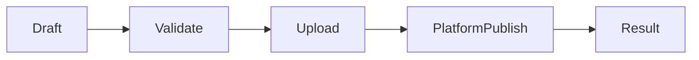

---

### Public API

```ts
publish()
schedule()
cancel()
retry()
```

---

### Dependencies

Allowed:

- Platform Adapters
- Media Module
- Core Services

Forbidden:

- Renderer
- Email Module
- Direct Database Access

# 8. Platform Adapter Layer

Platform Adapter Layer is responsible for integrating external content platforms
into YuMatrix Studio in a unified, stable, and extensible way.

Each platform (e.g. Xiaohongshu, Douyin, Bilibili) MUST be implemented as an
independent adapter that conforms to a strict interface contract.

---

## 8.1 Design Goals

The Platform Layer is designed to achieve:

- Platform independence from business logic
- Unified publishing interface
- Isolated platform-specific behavior
- Easy addition of new platforms without modifying existing modules
- Strong sandboxing and failure isolation

---

## 8.2 Core Concept

All platforms are treated as **Plugins**, not as hardcoded logic.

Business Modules MUST NOT:

- Call platform APIs directly
- Access platform-specific SDKs
- Embed platform logic

Instead, they MUST interact through:

> PlatformAdapter Interface

---

## 8.3 Platform Adapter Contract

Each platform MUST implement the following interface:

```ts
interface PlatformAdapter {

  /**
   * Authenticate user session
   */
  login(): Promise<LoginResult>

  /**
   * Logout current session
   */
  logout(): Promise<void>

  /**
   * Publish content to platform
   */
  publish(content: PublishPayload): Promise<PublishResult>

  /**
   * Upload media assets (image/video)
   */
  uploadMedia(file: MediaFile): Promise<UploadResult>

  /**
   * Fetch platform analytics data
   */
  fetchStatistics(query: StatsQuery): Promise<StatsResult>

  /**
   * Refresh session if expired
   */
  refreshSession(): Promise<SessionStatus>
}
```

---

## 8.4 Platform Lifecycle

Each platform adapter MUST follow a strict lifecycle:

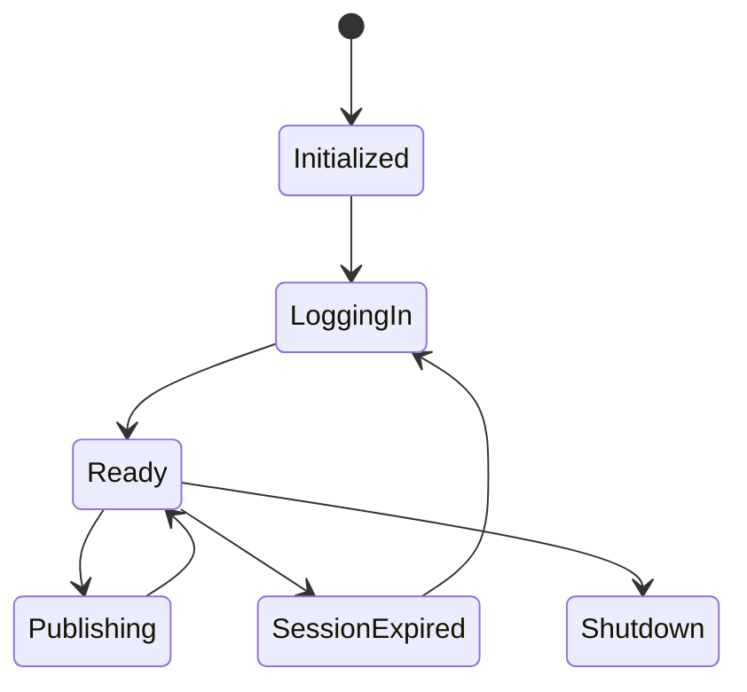

---

## 8.5 Platform Execution Flow

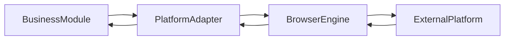

---

## 8.6 Isolation Rules

Each Platform Adapter MUST be fully isolated.

### MUST NOT:

- Share state with other platforms
- Access other Platform Adapters
- Access Business Module internals
- Access Renderer layer
- Access Core Database directly

---

### MUST:

- Use Core Services only (Logger, EventBus, Security)
- Communicate via structured events
- Fail independently without affecting system stability

---

## 8.7 Error Handling Model

All platform errors MUST follow unified format:

```ts
interface PlatformError {
  code: string
  message: string
  platform: string
  retryable: boolean
  timestamp: number
}
```

---

## 8.8 Event Model

Platform Adapters communicate via Event Bus:

### Emitted Events:

- platform.login.success
- platform.login.failed
- platform.publish.started
- platform.publish.success
- platform.publish.failed
- platform.session.expired

---

## 8.9 Supported Platforms (Initial)

| Platform | Status |
|----------|--------|
| Xiaohongshu | Active |
| Douyin | Active |
| Bilibili | Active |
| Kuaishou | Planned |
| TikTok | Planned |
| Instagram | Planned |

---

## 8.10 Security Boundaries

Platform Adapters operate in a **sandboxed environment**:

- No direct file system access outside allowed scope
- No direct renderer interaction
- No shared memory state
- Session isolation per platform

---

## 8.11 Extension Rule

To add a new platform:

1. Implement `PlatformAdapter`
2. Register in Platform Registry
3. Define platform config
4. Register event mappings
5. No changes to Business Modules required

---

## 8.12 Architectural Summary

Platform Layer acts as:

> A translation layer between Business Modules and external platforms.

It ensures:

- Business logic remains stable
- Platform changes do not affect core system
- New platforms can be added safely

# 9. AI Architecture (AI Hub)

The AI Hub is the unified intelligence layer of YuMatrix Studio.

It is responsible for abstracting all AI capabilities into a single, consistent
and extensible system that can support multiple providers, models, and tools.

---

## 9.1 Design Goals

The AI Architecture MUST achieve:

- Unified access to multiple AI providers
- Separation between business logic and AI logic
- Support for streaming responses
- Support for tool calling / function execution
- Provider-level extensibility
- Model-agnostic interface
- Observability and logging of all AI requests

---

## 9.2 AI System Overview

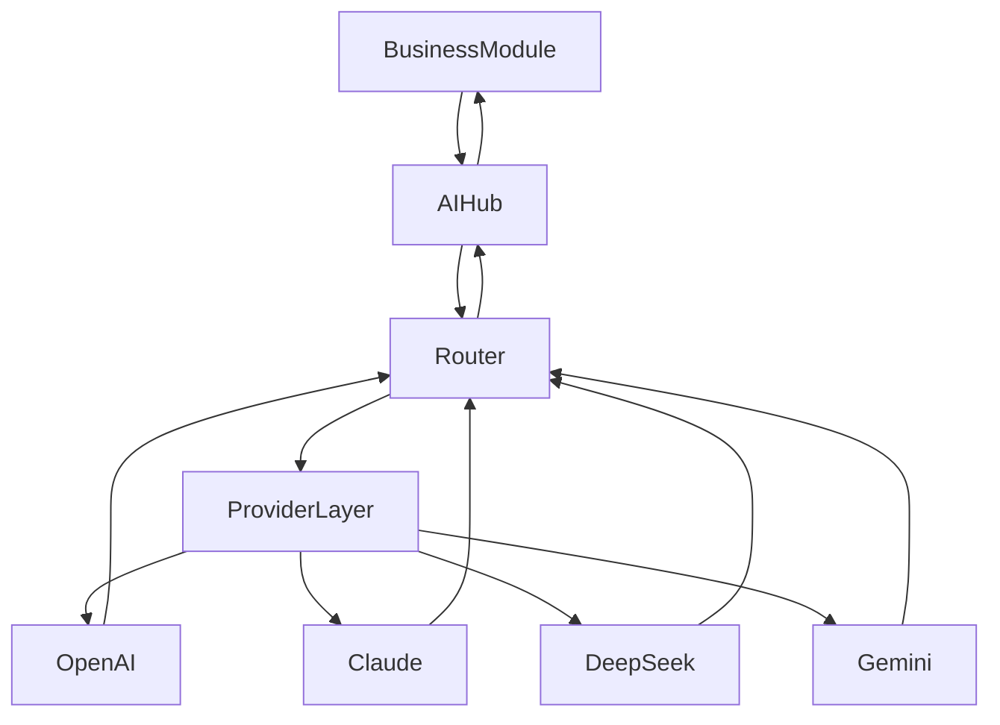

---

## 9.3 AI Hub Responsibilities

AI Hub MUST be responsible for:

- Request normalization
- Prompt management
- Provider selection
- Streaming aggregation
- Tool calling orchestration
- Response formatting
- Logging & tracing

AI Hub MUST NOT:

- Contain business logic
- Call Platform Adapters
- Access UI directly
- Store persistent business data

---

## 9.4 AI Request Lifecycle

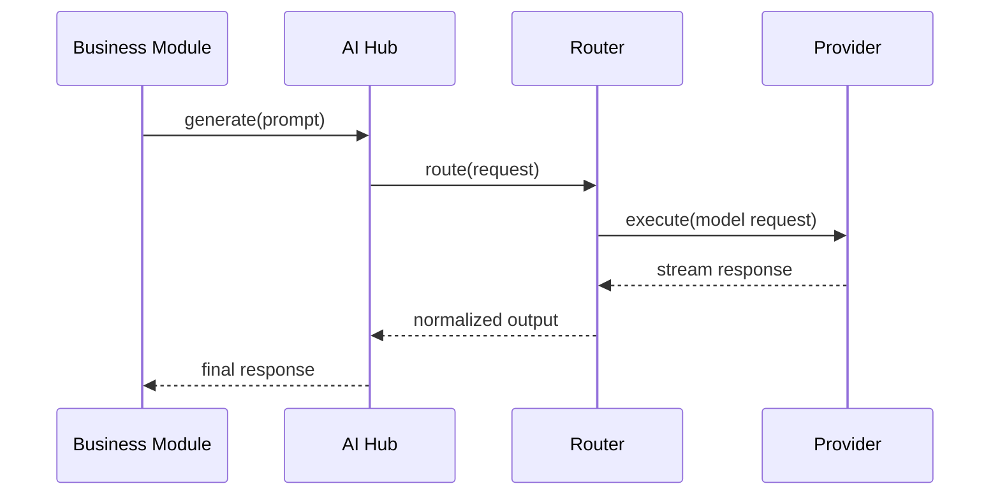

---

## 9.5 AI Hub Internal Modules

AI Hub is composed of the following sub-components:

| Component | Responsibility |
|----------|----------------|
| Router | Selects best provider/model |
| Prompt Engine | Manages prompt templates |
| Provider Layer | Abstracts external AI APIs |
| Streaming Engine | Handles real-time response streams |
| Tool Executor | Executes function/tool calls |
| Memory Layer | Optional short-term context storage |

---

## 9.6 AI Provider Contract

All AI providers MUST implement:

```ts
interface AIProvider {

  generate(prompt: PromptRequest): Promise<AIResponse>

  stream(prompt: PromptRequest): AsyncIterable<AIStreamChunk>

  embed?(input: string): Promise<number[]>

}
```

---

## 9.7 Router Strategy

The Router is responsible for selecting the best provider based on:

- Cost
- Latency
- Model capability
- Task type
- User configuration

### Example routing logic:

| Task Type | Preferred Provider |
|-----------|-------------------|
| Writing | Claude |
| Code | GPT-4 / DeepSeek |
| Reasoning | GPT-4 |
| Fast response | Gemini |

---

## 9.8 Tool Calling System

AI Hub supports function execution via Tool Calls.

### Flow:

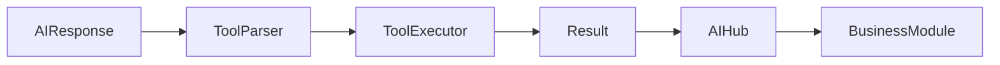

---

## 9.9 Streaming Architecture

AI responses MUST support streaming:

- Chunk-based delivery
- Incremental UI updates
- Cancellation support
- Backpressure handling

---

## 9.10 Memory Model (Optional Layer)

AI Hub MAY support short-term memory:

| Type | Scope |
|------|------|
| Session Memory | Per conversation |
| Task Memory | Per workflow |
| Global Memory | Disabled by default |

AI MUST NOT directly access persistent business databases.

---

## 9.11 Error Handling

All AI errors MUST follow unified format:

```ts
interface AIError {
  code: string
  message: string
  provider: string
  retryable: boolean
}
```

---

## 9.12 Observability

AI Hub MUST log:

- Request latency
- Token usage
- Provider selection
- Failure rate
- Tool call execution

All logs are sent to Core Logger.

---

## 9.13 Security Constraints

AI Hub MUST NOT:

- Access file system directly
- Execute arbitrary system commands
- Access platform credentials
- Modify business data without explicit module call

---

## 9.14 Architectural Summary

AI Hub acts as:

> A unified abstraction layer over multiple AI providers with routing, streaming, and tool execution capabilities.

It ensures:

- AI is modular and replaceable
- Business modules do not depend on provider logic
- Future AI models can be added without code refactoring

# 10. RPA Architecture (Automation Engine)

The RPA (Robotic Process Automation) Engine is responsible for executing
automated browser-based workflows across multiple platforms.

It is the execution layer of YuMatrix Studio.

---

## 10.1 Design Goals

The RPA Engine MUST achieve:

- Deterministic task execution
- Reliable browser automation
- Cross-platform script execution
- Stateful workflow management
- Fault tolerance and recovery
- Isolation from UI layer
- Event-driven execution model

---

## 10.2 RPA System Overview

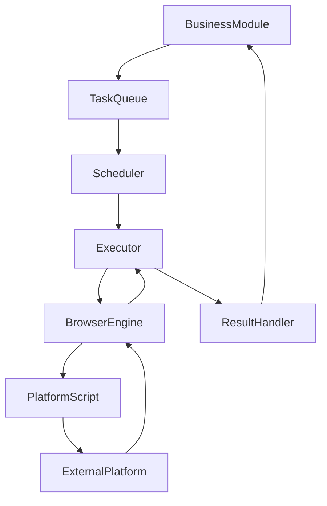

---

## 10.3 Core Components

| Component | Responsibility |
|----------|----------------|
| Task Queue | Stores all automation tasks |
| Scheduler | Determines execution order |
| Executor | Runs tasks in runtime |
| Browser Engine | Controls Playwright/Electron browser |
| State Machine | Tracks execution state |
| Script Engine | Executes platform-specific scripts |
| Result Handler | Processes execution results |

---

## 10.4 Task Lifecycle

Each RPA task MUST follow this lifecycle:

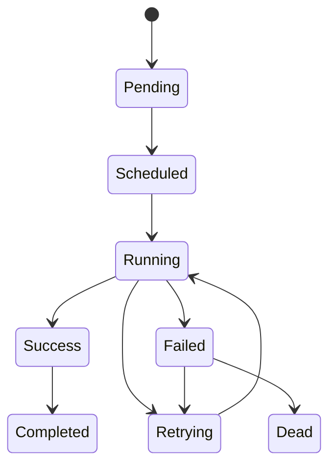

---

## 10.5 Task Model

```ts
interface RPATask {
  id: string
  type: string
  platform: string
  payload: any
  status: TaskStatus
  retryCount: number
  createdAt: number
}
```

---

## 10.6 Execution Model

RPA execution MUST be:

- Sequential per task (unless explicitly parallelized)
- Isolated per browser session
- Stateless between executions (except defined session state)
- Retryable on failure

---

## 10.7 Browser Engine Isolation

Each automation session MUST:

- Run in isolated browser context
- Maintain independent cookies/session storage
- Prevent cross-account leakage
- Be destroyed after task completion (or pooled if optimized)

---

## 10.8 Script System

Platform automation logic is implemented via scripts.

Each platform MUST define:

```text
Platform Script = deterministic automation steps
```

Example flow:

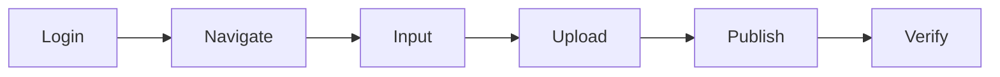

---

## 10.9 Error Handling Strategy

RPA errors are classified into:

| Type | Description | Action |
|------|-------------|--------|
| NetworkError | Network failure | Retry |
| ScriptError | Automation logic failure | Abort or fix |
| AuthError | Login/session expired | Re-login |
| PlatformChange | UI changed | Escalate |
| SystemError | Internal failure | Retry or fail |

---

## 10.10 Retry Strategy

RPA Engine MUST support:

- Exponential backoff retry
- Max retry limit per task
- Retry state persistence
- Failure escalation

---

## 10.11 Event Model

RPA Engine emits events via Core Event Bus:

- rpa.task.created
- rpa.task.started
- rpa.task.progress
- rpa.task.success
- rpa.task.failed
- rpa.task.retrying

---

## 10.12 Security Constraints

RPA Engine MUST:

- Operate in sandboxed browser environments
- Avoid direct system file access
- Avoid UI coupling
- Isolate credentials per session
- Encrypt sensitive automation data

---

## 10.13 Integration with Platform Layer

RPA Engine does NOT directly interact with Business Modules.

Instead:

Business Module → Task Queue → RPA Engine → Platform Script → Platform Adapter (optional abstraction layer)

---

## 10.14 Architectural Summary

RPA Engine acts as:

> A deterministic execution system for automating external platform workflows through controlled browser environments.

It ensures:

- Repeatable automation
- Platform independence
- Fault tolerance
- Scalable execution

# 11. Data Architecture

The Data Architecture defines how data is structured, stored, accessed, and
isolated across YuMatrix Studio.

It ensures data consistency, modular ownership, and safe persistence across
Business Modules, Platform Adapters, and Core Services.

---

## 11.1 Design Goals

The Data Layer MUST achieve:

- Clear ownership of data per module
- No shared mutable state between modules
- Consistent data access patterns
- Safe multi-account isolation
- Predictable persistence lifecycle
- Separation between runtime state and persistent state

---

## 11.2 Data Ownership Principle

Each data entity MUST have a single owner module.

| Data Type | Owner Module |
|------------|-------------|
| Account | Account Module |
| Session | Account Module |
| PublishTask | Publish Module |
| MediaAsset | Media Module |
| AIRequest | AI Hub |
| RPAExecution | RPA Engine |
| AnalyticsRecord | Analytics Module |

---

## 11.3 Data Access Rule

All data access MUST follow:

```text
Module → Repository → Core Database → Storage Engine
```

---

### Forbidden Access Patterns

❌ Renderer → Database  
❌ Platform → Database  
❌ RPA → Direct Module State  
❌ AI Hub → Business DB Direct Access  

---

## 11.4 Data Flow Architecture

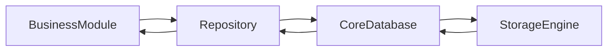

---

## 11.5 Repository Pattern Requirement

All modules MUST use Repository Layer.

Example:

```ts
interface AccountRepository {

  createAccount(data: Account): Promise<void>

  getAccount(id: string): Promise<Account | null>

  updateAccount(id: string, data: Partial<Account>): Promise<void>

  deleteAccount(id: string): Promise<void>

}
```

---

## 11.6 Multi-Account Isolation Model

Each account MUST have isolated data scope:

```text
Account A
   ↓
Session A
   ↓
Data A

Account B
   ↓
Session B
   ↓
Data B
```

No cross-account data leakage is allowed.

---

## 11.7 Runtime vs Persistent Data

### Runtime Data (Ephemeral)

- UI state
- Temporary AI responses
- RPA execution state
- In-memory cache

### Persistent Data

- Accounts
- Publish history
- Media assets
- Analytics
- Sessions

---

## 11.8 Caching Strategy

Caching is allowed ONLY in:

- Core Services
- Repository Layer

Caching MUST NOT:

- Be implemented in Renderer
- Override persistent state
- Bypass Repository Layer

---

## 11.9 Data Consistency Model

System follows:

> Eventual Consistency for distributed operations  
> Strong Consistency for account/session data  

---

## 11.10 Event-Driven Data Updates

Data changes MUST emit events:

```text
account.created
account.updated
publish.created
media.uploaded
rpa.completed
```

---

## 11.11 Backup & Recovery

Data layer MUST support:

- Snapshot-based backup
- Session recovery
- Task replay (RPA)
- Publish retry restoration

---

## 11.12 Security Rules

Sensitive data MUST:

- Be encrypted at rest
- Be isolated per account
- Never be exposed to Renderer directly
- Never be stored in plain logs

---

## 11.13 Architectural Summary

Data Architecture ensures:

> Every piece of data has a clear owner, a clear lifecycle, and a controlled access path.

It guarantees:

- No hidden shared state
- No cross-module contamination
- Predictable system behavior

# 12. Event Architecture

The Event Architecture defines the communication mechanism between all
modules in YuMatrix Studio.

It is the primary mechanism for decoupling Business Modules, Core Services,
Platform Adapters, and RPA Engine.

---

## 12.1 Design Goals

The Event System MUST achieve:

- Loose coupling between modules
- Asynchronous communication support
- Cross-module observability
- Realtime system state propagation
- Replayable event history (for debugging and recovery)
- Scalable event routing

---

## 12.2 Event-Driven Model

All inter-module communication SHOULD use events instead of direct calls.

```text
Module A → Event Bus → Module B
```

Direct invocation between modules is discouraged unless inside the same bounded context.

---

## 12.3 Event Bus Architecture

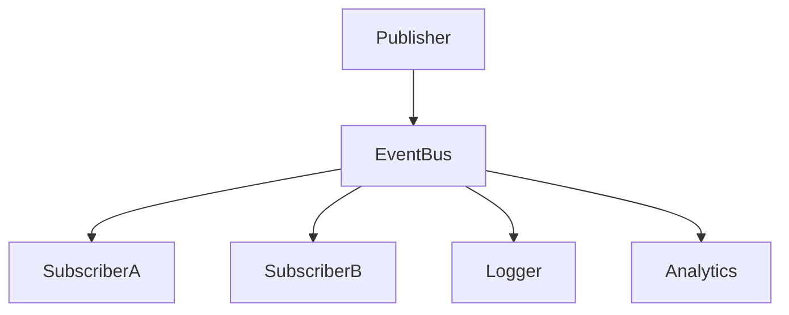

---

## 12.4 Event Types

All events MUST follow a structured naming convention:

```text
<domain>.<action>.<status>
```

### Examples:

- account.created
- account.updated
- publish.started
- publish.completed
- rpa.task.failed
- ai.response.generated
- platform.login.success

---

## 12.5 Event Payload Standard

All events MUST follow a unified structure:

```ts
interface BaseEvent {
  id: string
  type: string
  timestamp: number
  source: string
  payload: any
}
```

---

## 12.6 Event Flow Model

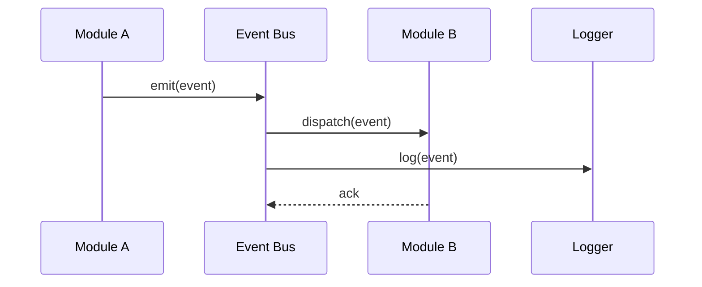

---

## 12.7 Event Categories

### 1. Domain Events (业务事件)

Triggered by business logic:

- account.created
- publish.completed
- media.uploaded

---

### 2. System Events (系统事件)

Triggered by system behavior:

- system.start
- system.shutdown
- error.occurred

---

### 3. RPA Events (自动化事件)

- rpa.task.started
- rpa.task.progress
- rpa.task.failed

---

### 4. AI Events (智能事件)

- ai.request.sent
- ai.response.received
- ai.tool.executed

---

## 12.8 Event Ordering Rules

- Events MUST preserve order within the same domain stream
- Cross-domain ordering is NOT guaranteed
- Critical workflows MUST implement idempotency

---

## 12.9 Event Persistence

Events MAY be persisted for:

- Debugging
- Replay
- Audit logs
- Analytics

Event storage MUST NOT affect runtime performance.

---

## 12.10 Event Replay System

System MUST support replay for:

- RPA recovery
- Publish retry
- AI debugging

Replay MUST NOT modify original event history.

---

## 12.11 Event Security Rules

Events MUST NOT:

- Contain raw credentials
- Expose sensitive account data
- Include unencrypted tokens
- Leak platform-specific secrets

Sensitive data MUST be anonymized or encrypted.

---

## 12.12 Event Bus Constraints

Event Bus MUST:

- Be single source of event distribution
- Prevent infinite loops
- Support backpressure handling
- Prevent duplicate event dispatch

---

## 12.13 Architectural Summary

Event Architecture acts as:

> The nervous system of YuMatrix Studio.

It ensures:

- Modules do not directly depend on each other
- System state is observable
- Workflows are traceable and replayable
- Architecture remains scalable under complexity

# 13. Dependency Rules System

The Dependency Rules System defines strict boundaries for module interactions
across YuMatrix Studio.

It ensures architectural integrity, prevents circular dependencies, and
enforces long-term maintainability.

---

## 13.1 Core Principle

All dependencies in YuMatrix Studio MUST follow:

> Strict One-Way Dependency Graph

```text
Higher Layer → Lower Layer ONLY
```

Reverse dependencies are strictly forbidden.

---

## 13.2 Layer Hierarchy

The system is divided into the following layers:

```text
Application Layer
↓
Business Modules Layer
↓
Platform Adapter Layer
↓
Core Services Layer
↓
Infrastructure Layer
```

---

## 13.3 Allowed Dependency Matrix

| From | To | Allowed |
|------|----|--------|
| Business Modules | Core Services | ✅ |
| Business Modules | Platform Adapters | ✅ |
| Platform Adapters | Core Services | ✅ |
| Core Services | Infrastructure | ✅ |
| Renderer | Business Modules (via IPC only) | ⚠️ |
| Renderer | Core Services | ❌ |
| Platform | Platform | ❌ |

---

## 13.4 Forbidden Dependency Rules

The following dependencies are STRICTLY FORBIDDEN:

### ❌ UI Layer Violations

- Renderer → Database
- Renderer → File System
- Renderer → RPA Engine
- Renderer → Platform Adapter

---

### ❌ Business Layer Violations

- Publish → Account (direct import)
- AI Hub → Platform Adapter
- Analytics → RPA Engine
- Cross-module direct state sharing

---

### ❌ Platform Violations

- Platform A → Platform B
- Platform → Renderer
- Platform → Business Module internal logic

---

### ❌ Core Violations

- Core → Business Modules
- Core → Renderer
- Core → Platform Adapters

Core MUST remain dependency-free from business logic.

---

## 13.5 Circular Dependency Rule

Any circular dependency is strictly forbidden:

```text
A → B → C → A ❌
```

Detection MUST be enforced during:

- Build time
- CI pipeline
- Lint stage

---

## 13.6 Dependency Enforcement Strategy

The system MUST enforce rules via:

### 1. Static Analysis

- ESLint rules
- TypeScript path restrictions
- Import boundary validation

---

### 2. Build-Time Validation

- Dependency graph validation
- Circular dependency detection
- Module boundary verification

---

### 3. Runtime Safeguards

- Core service isolation checks
- IPC boundary enforcement

---

## 13.7 Module Import Rules

### Business Modules

MUST only import:

- Core Services
- Other internal utilities (same module only)

MUST NOT import:

- Renderer
- Platform internals
- Other business modules (directly)

---

### Platform Adapters

MUST only import:

- Core Services

MUST NOT import:

- Business Modules
- Renderer
- Other Platforms

---

### Core Services

MUST NOT import:

- Any Business Module
- Any Platform Adapter
- Renderer Layer

---

## 13.8 Communication Rule

All cross-module communication MUST follow:

```text
Event Bus OR IPC ONLY
```

Direct function calls across module boundaries are discouraged.

---

## 13.9 Architectural Integrity Model

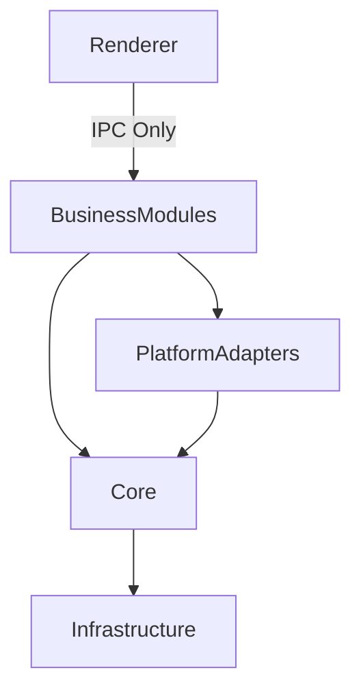

No reverse arrows are allowed.

---

## 13.10 Dependency Failure Handling

If a forbidden dependency is detected:

System MUST:

1. Block build (CI failure)
2. Log violation
3. Identify module source
4. Prevent runtime execution if possible

---

## 13.11 Architectural Summary

Dependency Rules System ensures:

> The architecture cannot silently degrade over time.

It guarantees:

- Long-term maintainability
- Predictable structure
- No hidden coupling
- Safe scaling of modules and platforms

# 14. Roadmap & Evolution Strategy

This section defines the long-term evolution strategy of YuMatrix Studio.

It ensures the architecture remains stable while allowing continuous expansion,
refactoring, and feature growth.

---

## 14.1 Architecture Philosophy of Evolution

YuMatrix Studio follows a principle of:

> Incremental Evolution, Not Big-Bang Refactoring

Meaning:

- No full system rewrites
- No destructive refactors
- Continuous modular improvement
- Backward-compatible evolution

---

## 14.2 Sprint-Based Development Model

The system evolves through structured sprints:

```text
Sprint → Targeted Architectural Improvement → Stabilization → Next Sprint
```

---

## 14.3 Current Roadmap Overview

| Sprint | Goal |
|--------|------|
| Sprint 0 | Project cleanup & structure normalization |
| Sprint 1 | Core architecture foundation |
| Sprint 2 | Database & repository refactor |
| Sprint 3 | IPC stabilization layer |
| Sprint 4 | Platform SDK standardization |
| Sprint 5 | RPA engine stabilization |
| Sprint 6 | AI Hub optimization |
| Sprint 7 | Business modules refactor |
| Sprint 8 | Renderer architecture cleanup |
| Sprint 9 | Testing framework completion |
| Sprint 10 | Performance optimization |
| Sprint 11 | Plugin ecosystem |
| Sprint 12 | Production release system |

---

## 14.4 Evolution Strategy by Layer

### Core Layer

Core MUST:

- Remain stable across all sprints
- Only accept backward-compatible changes
- Never contain business logic

---

### Business Modules

Business Modules evolve through:

- Internal refactoring
- API stabilization
- Event-driven migration
- Gradual decoupling

---

### Platform Layer

Platform Adapters evolve through:

- Script abstraction improvements
- UI automation resilience upgrades
- New platform onboarding

No breaking changes allowed for existing adapters.

---

### RPA Engine

RPA evolves through:

- Improved scheduling algorithms
- Better failure recovery
- Parallel execution optimization
- Browser engine upgrades

---

### AI Hub

AI Hub evolves through:

- New provider integration
- Improved routing strategy
- Tool-calling expansion
- Memory system refinement

---

## 14.5 Versioning Strategy

All modules MUST follow semantic versioning:

```text
MAJOR.MINOR.PATCH
```

Rules:

- MAJOR → breaking architectural changes
- MINOR → feature additions
- PATCH → bug fixes

---

## 14.6 Backward Compatibility Rule

Any change MUST ensure:

- Existing modules continue working
- Existing APIs remain valid
- Event contracts remain compatible

Breaking changes MUST:

- Be isolated to new versions
- Provide migration path
- Be documented in ADR

---

## 14.7 Architectural Guardrails

The system MUST enforce:

- Dependency Rules (Section 13)
- Event Contract Stability
- Core Service Stability
- Platform Adapter Isolation

---

## 14.8 Failure Recovery Strategy

If architecture degradation occurs:

1. Identify violating module
2. Isolate dependency violation
3. Refactor into Core / Module boundary
4. Re-validate dependency graph

---

## 14.9 Future Expansion Areas

The system is designed for future expansion:

### 1. Workflow Engine

- Visual automation builder
- AI-assisted workflow generation

---

### 2. Plugin Marketplace

- Third-party extensions
- Monetization layer
- Sandbox execution

---

### 3. Cloud Sync Layer

- Multi-device sync
- Team collaboration
- Remote execution

---

### 4. AI Agent System

- Autonomous task execution
- Multi-agent coordination
- Long-running workflows

---

## 14.10 Architectural End State Vision

YuMatrix Studio ultimately evolves into:

> A distributed AI + Automation Operating System for digital work.

Capable of:

- Autonomous content generation
- Multi-platform publishing
- Self-healing automation workflows
- Plugin-based ecosystem expansion

---

## 14.11 Final Summary

This architecture ensures:

- Long-term scalability
- Controlled complexity growth
- Stable core system
- Safe modular evolution
- AI-native extensibility