# YuMatrix Studio 目标架构设计文档
# YuMatrix Studio Target Architecture

> **文档编号 Document ID:** YM-ARCH-003
> **版本 Version:** 2.0.0 (草案 Draft)
> **文档状态 Status:** 草稿 Draft
> **归属负责人 Owner:** 架构团队 Architecture Team
> **最后更新 Last Updated:** 2026-07-02

---

# 执行摘要 Executive Summary
YuMatrix Studio 是一套原生面向AI的桌面自动化平台，面向多平台内容运营、浏览器自动化（RPA）与智能工作流编排场景打造。

本项目与传统 Electron 应用有本质区别：Electron 仅作为程序宿主存在；业务能力、第三方平台集成、自动化引擎、AI 服务全部拆分为独立模块，每个模块职责清晰、依赖边界严格隔离。

本文档定义项目最终目标架构，是后续开发、重构、架构迭代的**唯一基准规范**。
所有开发实现、代码评审、代码重构工作**必须**遵循本规范。

---

# 1. 愿景 Vision
## 项目愿景 Project Vision
YuMatrix Studio 致力于打造面向内容创作者、数字化运营团队的AI驱动桌面作业平台。

平台将人工智能、浏览器自动化RPA、多平台分发发布、数据分析能力统一整合至一套工作流体系，让用户自动化处理重复运营任务，同时完整掌控全部业务流程。

## 核心能力 Core Capabilities
平台提供以下核心功能：
- AI 辅助内容生成
- 多渠道内容分发发布
- 浏览器自动化RPA流程
- 多账号统一管理
- 媒体素材处理
- 数据统计与报表分析
- 可视化工作流编排
- 基于插件体系的平台扩展能力

## 长期发展目标 Long-term Goals
YuMatrix Studio 不会局限于桌面客户端形态，后续将支持多端部署形态：
- 桌面客户端（Electron）
- Web 后台管理面板
- 云端任务执行节点 Cloud Worker
- 命令行工具 CLI Tools
- 插件市场 Plugin Marketplace
- 多人团队协同平台

---

# 2. 架构设计目标 Architecture Goals
目标架构围绕以下六大核心目标设计：

| 目标 Goal | 说明 Description |
|------|-------------|
| 可扩展 Scalability | 新增业务模块、第三方平台无需改动底层核心架构 |
| 易维护 Maintainability | 业务逻辑分层隔离，独立迭代互不干扰 |
| 可扩展适配 Extensibility | 所有第三方平台接入遵循统一适配器契约 |
| 可测试 Testability | 核心服务、业务模块支持单独单元测试 |
| 高稳定性 Stability | 核心底层服务稳定不变，上层业务模块可快速迭代 |
| AI原生 AI Native | AI能力作为平台一等公民底层服务，而非可选附加功能 |

---

# 3. 架构设计原则 Architecture Principles
YuMatrix Studio 所有组件**必须**遵守下述设计原则

## 3.1 面向业务分层架构 Business-Oriented Architecture
系统按业务能力划分，而非按技术框架划分。
业务模块承载用户可见功能，底层技术基础设施完全封装在 Core 核心层，对外透明。

## 3.2 稳定内核 Stable Core
Core 核心层为全平台提供基础底层服务。
核心服务保持轻量、可复用，完全独立于上层业务逻辑。
**禁止将任何业务代码放置在 `src/core` 目录下。**

## 3.3 模块化业务设计 Modular Business Design
每一项业务能力对应一个独立业务模块，单个模块需满足：
- 单一职责原则，只负责一类业务
- 全权持有自身业务数据模型
- 对外暴露标准化公共API
- 内部实现细节完全封装隐藏

## 3.4 插件优先的平台集成 Plugin-First Platform Integration
所有支持的内容平台（小红书、抖音、B站等）必须实现统一适配器标准接口。
业务模块仅与平台适配器交互，禁止直接对接各平台私有实现逻辑。

## 3.5 事件驱动通信 Event-Driven Communication
模块间通信优先采用事件总线机制，尽可能减少模块间直接硬依赖。

## 3.6 AI原生设计 AI Native
人工智能能力属于平台底层公共服务，而非某一个业务模块的附属功能。
所有大模型服务商统一由 AI Hub 中心管控调度。

---

# 4. 系统上下文 System Context
下图为 YuMatrix Studio 逻辑架构分层示意图
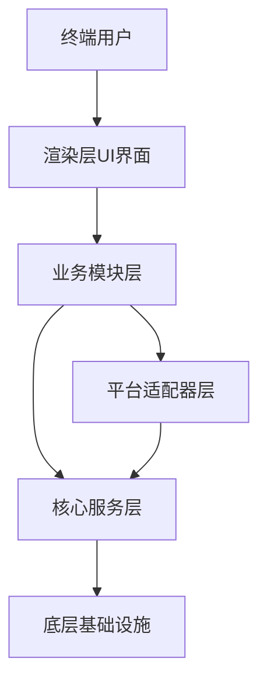

## 分层职责 Layer Responsibilities
| 分层 Layer | 职责 Responsibility |
|--------|----------------|
| Application 应用宿主层 | Electron 生命周期、多进程管理 |
| Renderer 渲染层 | React 构建的前端用户界面 |
| Business Modules 业务模块 | 发布、账号、数据分析、媒体处理、AI调度中心 |
| Platform Adapters 平台适配器 | 小红书、抖音、B站及后续新增第三方平台适配 |
| Core Services 核心服务 | 数据库、进程通信IPC、日志、配置、安全加密、事件总线 |
| Infrastructure 基础设施 | SQLite数据库、Playwright浏览器引擎、云端接口、本地文件系统 |

---

# 5. 整体分层架构 Overall Architecture
目标架构采用严格自上而下分层结构：
```text
Application 应用宿主层
        │
────────┼────────
        │
Business Modules 业务模块层
        │
────────┼────────
        │
Platform Adapters 平台适配器层
        │
────────┼────────
        │
Core Services 核心服务层
        │
────────┼────────
        │
Infrastructure 底层基础设施
```

每层职责边界明确，依赖规则强制约束：**依赖只允许从上往下单向引用**，反向依赖严格禁止。

## 允许的依赖方向 ✅ Allowed
```
应用宿主层 → 业务模块层
业务模块层 → 平台适配器层
业务模块层 → 核心服务层
平台适配器层 → 核心服务层
核心服务层 → 基础设施
```

## 禁止的依赖方向 ❌ Forbidden
- 渲染层直接依赖数据库、Playwright浏览器引擎
- 平台适配器互相引用
- 核心层反向依赖业务模块
- 业务模块直接耦合渲染UI层
- 循环依赖（A依赖B，B又依赖A）

---

# 6. 核心服务层 Core Services
Core 核心服务是 YuMatrix Studio 的稳定底层基座，为所有业务模块、平台适配器提供公共基础能力。
**核心层严禁包含任何业务逻辑。**

## 6.1 核心层职责 Core Responsibilities
核心层统一处理：
- 数据持久化存储
- 主渲染进程跨进程通信IPC
- 全局日志系统
- 全局配置管理
- 事件驱动通信总线
- 安全工具集（加密、浏览器指纹隔离）

## 6.2 核心内置模块 Core Modules
| 模块 Module | 职责 Responsibility |
|--------|----------------|
| AI AI调度内核 | AI统一路由分发、各大模型服务商抽象封装 |
| Database 数据库 | 全局数据持久化封装层 |
| IPC 进程通信 | Electron主渲染进程数据交互 |
| Logger 日志 | 全系统统一日志输出 |
| Config 配置 | 全局系统配置读写管理 |
| Event Bus 事件总线 | 跨模块异步事件通信 |
| Security 安全工具 | 数据加密、浏览器指纹、会话隔离 |

## 6.3 核心层强制设计规则 Core Design Rules
Core 必须遵守：
- 不依赖任何业务模块
- 不依赖前端渲染层Renderer
- 不包含任何第三方平台特有逻辑
- 仅承载无状态工具或底层基础设施逻辑

Core 禁止实现：
- 业务工作流流程
- 调用平台适配器
- 读写UI界面状态

## 6.4 核心层交互模型 Core Interaction Model
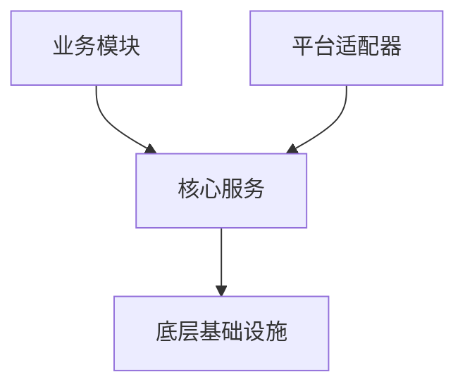
核心层仅作为共享底层基座，不承担业务流程编排角色。

---

# 7. 业务模块层 Business Modules
业务模块承载 YuMatrix Studio 领域专属业务能力，每个模块完全独立，封装自有业务逻辑、数据模型、执行工作流。

## 7.1 模块通用设计规范 Module Design Rules
每一个业务模块必须满足：
- 全权持有自身领域业务逻辑
- 对外暴露标准化公共服务API
- 避免直接导入其他业务模块
- 跨模块交互统一通过 Core 事件总线完成

## 7.2 全部业务模块清单 Business Modules List
| 模块 Module | 职责 Responsibility |
|--------|----------------|
| Account 账号模块 | 第三方账号身份、会话缓存、浏览器指纹管理 |
| Publish 发布模块 | 多平台内容分发完整工作流 |
| AI Hub AI调度中心 | 全平台AI能力统一编排调度层 |
| Media 媒体模块 | 图片/视频素材处理、本地存储管理 |
| Analytics 数据分析模块 | 数据统计、报表生成 |
| Email 消息模块 | 站内消息、任务通知推送 |
| Settings 设置模块 | 用户偏好、个性化配置管理 |
| Workspace 工作空间模块 | 多项目工程隔离管理 |

## 7.3 账号模块示例规范 Account Module (Example Specification)
### 职责 Responsibility
管理第三方账号身份与会话完整生命周期

### 自有数据实体 Owned Entities
- Account 账号信息
- Session 登录会话
- Fingerprint 浏览器指纹
- Cookie 站点缓存Cookie

### 对外公共API Public API
```ts
createAccount()       // 创建账号
getAccount()          // 查询账号信息
updateAccount()       // 更新账号配置
deleteAccount()       // 删除账号
syncSession()         // 同步登录会话缓存
```

### 允许依赖 Allowed Dependencies
- Core Database 核心数据库
- Core Security 核心安全工具
- Core Config 全局配置

### 禁止依赖 Forbidden Dependencies
- 前端渲染层Renderer
- Publish 发布模块
- AI Hub AI调度中心

### 对外抛出事件 Events
模块向外推送事件：
- AccountCreated 账号创建成功
- AccountUpdated 账号信息更新
- SessionExpired 登录会话过期

## 7.4 发布模块示例规范 Publish Module (Example Specification)
### 职责 Responsibility
处理全平台内容发布完整业务流程

### 业务工作流 Workflow
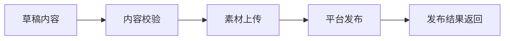

### 对外公共API Public API
```ts
publish()  // 立即发布内容
schedule()   // 定时预约发布
cancel()     // 取消发布任务
retry()      // 失败重试发布
```

### 依赖规范 Dependencies
允许依赖：
- Platform Adapters 平台适配器
- Media Module 媒体素材模块
- Core Services 全部核心服务

禁止依赖：
- 前端渲染层Renderer
- Email 消息通知模块
- 直接操作底层数据库

---

# 8. 平台适配器层 Platform Adapter Layer
平台适配器层负责将各类外部内容平台统一接入YuMatrix Studio，实现标准化、易扩展、低耦合的集成方案。

每个平台（小红书/抖音/B站等）必须独立实现适配器，严格遵守统一接口契约。

## 8.1 设计目标 Design Goals
平台适配器层设计目标：
- 业务逻辑与第三方平台完全解耦
- 所有平台对外提供统一发布接口
- 隔离各平台差异化特殊逻辑
- 新增平台无需修改上层业务代码
- 独立沙箱运行，故障隔离互不影响

## 8.2 核心设计思想 Core Concept
所有第三方平台统一视作**插件**，而非硬编码内置逻辑。

业务模块禁止：
- 直接调用平台私有接口
- 引入平台专属SDK
- 内嵌平台差异化业务逻辑

业务模块统一交互标准：
> PlatformAdapter 标准适配器接口

## 8.3 平台适配器统一契约 Platform Adapter Contract
所有平台必须实现下述标准接口：
```ts
interface PlatformAdapter {
  /**
   * 账号登录，建立会话
   */
  login(): Promise<LoginResult>

  /**
   * 退出当前账号登录
   */
  logout(): Promise<void>

  /**
   * 向平台发布图文/视频内容
   */
  publish(content: PublishPayload): Promise<PublishResult>

  /**
   * 上传图片、视频媒体素材
   */
  uploadMedia(file: MediaFile): Promise<UploadResult>

  /**
   * 拉取平台作品数据、流量统计
   */
  fetchStatistics(query: StatsQuery): Promise<StatsResult>

  /**
   * 会话过期自动刷新登录态
   */
  refreshSession(): Promise<SessionStatus>
}
```

## 8.4 平台适配器生命周期 Platform Lifecycle
每个适配器遵循标准化状态流转：
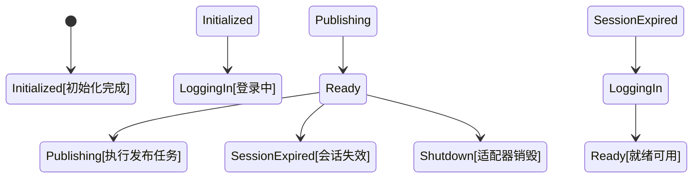

## 8.5 平台执行完整流程 Platform Execution Flow
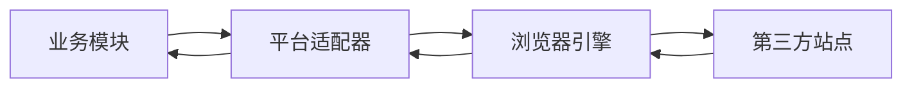

## 8.6 适配器隔离规范 Isolation Rules
单个平台适配器完全隔离约束：
### 禁止行为 MUST NOT:
- 和其他平台适配器共享内存状态
- 直接调用其他平台适配器
- 访问业务模块内部私有逻辑
- 直接操作前端渲染层
- 绕过Repository直连数据库

### 强制行为 MUST:
- 仅调用核心层服务（日志、事件总线、安全加密）
- 通过结构化事件完成跨层通信
- 独立故障熔断，单一平台崩溃不影响整体系统稳定

## 8.7 统一错误模型 Error Handling Model
所有平台异常统一标准化结构：
```ts
interface PlatformError {
  code: string        // 错误码
  message: string     // 错误描述
  platform: string    // 出错平台标识
  retryable: boolean  // 是否支持自动重试
  timestamp: number   // 报错时间戳
}
```

## 8.8 适配器事件体系 Event Model
适配器通过全局事件总线对外推送事件：
### 对外抛出事件 Emitted Events:
- platform.login.success 平台登录成功
- platform.login.failed 平台登录失败
- platform.publish.started 开始发布内容
- platform.publish.success 发布完成
- platform.publish.failed 发布失败
- platform.session.expired 登录会话过期

## 8.9 首期支持平台列表 Supported Platforms (Initial)
| 平台 Platform | 开发状态 Status |
|----------|--------|
| Xiaohongshu 小红书 | 已开发 Active |
| Douyin 抖音 | 已开发 Active |
| Bilibili B站 | 已开发 Active |
| Kuaishou 快手 | 规划开发 Planned |
| TikTok 海外抖音 | 规划开发 Planned |
| Instagram 照片墙 | 规划开发 Planned |

## 8.10 安全隔离边界 Security Boundaries
平台适配器运行在独立沙箱环境：
- 仅允许访问指定目录文件，禁止全盘文件读写
- 禁止直接和前端渲染层交互
- 无共享内存全局状态
- 每个平台账号会话完全隔离

## 8.11 新增平台扩展流程 Extension Rule
接入新第三方平台仅需五步，无需改动上层业务：
1. 完整实现 `PlatformAdapter` 标准接口
2. 在平台注册中心完成适配器注册
3. 定义该平台专属配置项
4. 绑定对应事件映射关系
5. 无需修改任何业务模块代码

## 8.12 架构总结 Architectural Summary
平台适配器层定位：
> 业务模块与外部第三方平台之间的翻译适配层

保障效果：
- 上层业务逻辑稳定不受平台改版影响
- 第三方平台接口变更仅需修改对应适配器
- 安全、无侵入式新增各类内容平台

---

# 9. AI 分层架构（AI Hub 统一调度中心）
AI Hub 是 YuMatrix Studio 全局统一智能能力层，抽象整合全部AI相关功能，提供统一、可扩展、多模型兼容的调度体系，支持多服务商、多模型、工具函数调用。

## 9.1 架构设计目标 Design Goals
AI 分层架构需达成以下目标：
- 统一标准方式调用多家AI服务商
- 业务逻辑与大模型底层逻辑完全解耦
- 支持流式实时输出返回
- 支持工具函数/插件调用执行
- 服务商横向扩展能力
- 模型无关通用调用接口
- 全量AI请求埋点、日志、可观测性

## 9.2 AI 整体架构总览 AI System Overview
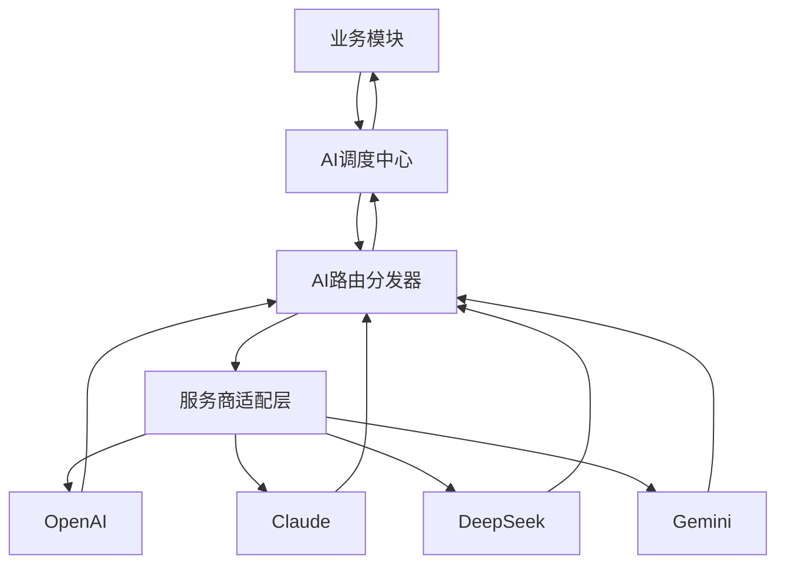

## 9.3 AI Hub 核心职责 AI Hub Responsibilities
AI Hub 统一负责：
- AI 请求参数标准化转换
- 提示词模板统一管理
- 服务商、模型智能路由选择
- 流式返回数据统一聚合处理
- 工具函数调用编排执行
- 统一格式化模型返回结果
- 请求日志、调用链路追踪

AI Hub 禁止：
- 包含任何业务流程逻辑
- 直接调用平台适配器
- 直接操作前端UI界面
- 持久化存储业务数据

## 9.4 AI 请求完整生命周期 AI Request Lifecycle
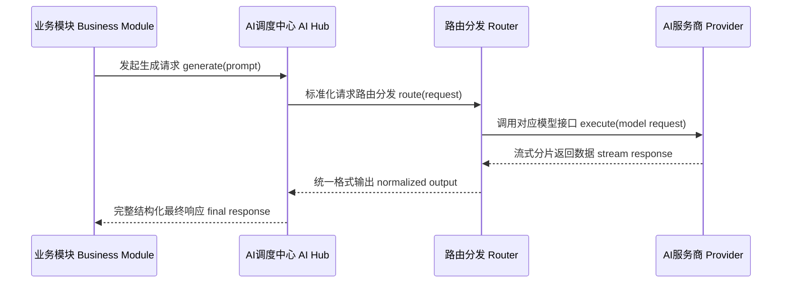

## 9.5 AI Hub 内部子组件 AI Hub Internal Modules
AI Hub 由以下子模块组成：
| 组件 Component | 职责 Responsibility |
|----------|----------------|
| Router 路由分发器 | 根据策略自动选择最优服务商/模型 |
| Prompt Engine 提示词引擎 | 全局提示词模板、变量渲染管理 |
| Provider Layer 服务商适配层 | 各大厂商AI接口抽象封装 |
| Streaming Engine 流式引擎 | 处理实时分片流式输出 |
| Tool Executor 工具执行器 | 解析并执行AI触发的工具函数调用 |
| Memory Layer 短期记忆层 | 可选：对话上下文短期缓存存储 |

## 9.6 AI服务商统一标准契约 AI Provider Contract
所有大模型服务商必须实现统一接口：
```ts
interface AIProvider {
  // 一次性完整生成
  generate(prompt: PromptRequest): Promise<AIResponse>

  // 流式增量返回
  stream(prompt: PromptRequest): AsyncIterable<AIStreamChunk>

  // 向量嵌入（可选）
  embed?(input: string): Promise<number[]>
}
```

## 9.7 路由分发策略 Router Strategy
路由分发器根据多维度条件自动匹配最优服务商：
- 调用成本
- 接口响应延迟
- 模型能力上限
- 当前任务类型
- 用户自定义配置

### 路由策略示例
| 任务类型 Task Type | 优选服务商 Preferred Provider |
|-----------|-------------------|
| 文案写作 | Claude |
| 代码生成 | GPT-4 / DeepSeek |
| 复杂逻辑推理 | GPT-4 |
| 快速轻量化输出 | Gemini |

## 9.8 工具调用执行体系 Tool Calling System
AI Hub 支持大模型主动调用自定义工具函数，完整流程：
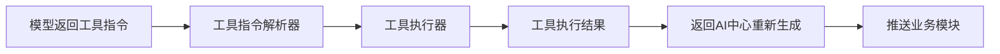

## 9.9 流式输出架构 Streaming Architecture
全部AI生成接口强制支持流式返回：
- 分片增量数据下发
- 前端UI实时局部刷新
- 支持任务中途取消
- 背压限流处理，防止数据阻塞

## 9.10 短期记忆模型 Memory Model (Optional Layer)
AI Hub 可选开启上下文短期记忆，分三类作用域：
| 类型 Type | 作用域 Scope |
|------|------|
| Session Memory 会话记忆 | 单次对话全局上下文 |
| Task Memory 任务记忆 | 单条工作流独立上下文 |
| Global Memory 全局记忆 | 默认关闭，不长期缓存 |

AI记忆层禁止直接读写业务持久化数据库。

## 9.11 AI统一错误处理 Error Handling
所有AI接口异常标准化结构：
```ts
interface AIError {
  code: string         // 错误码
  message: string      // 错误描述
  provider: string     // 异常服务商标识
  retryable: boolean   // 是否可自动重试
}
```

## 9.12 可观测埋点 Observability
AI Hub 完整记录每一次调用指标：
- 请求整体耗时
- 输入输出Token消耗
- 服务商路由选择记录
- 接口失败率统计
- 工具函数执行日志
全部日志统一推送至Core全局日志系统。

## 9.13 安全约束 Security Constraints
AI Hub 禁止：
- 直接读写本地文件系统
- 执行任意系统命令
- 读取第三方平台账号密钥凭证
- 未经业务模块调用直接修改业务数据

## 9.14 AI分层架构总结 Architectural Summary
AI Hub 定位：
> 多AI服务商统一抽象调度层，内置路由分发、流式输出、工具函数完整执行能力

保障效果：
- AI能力模块化、可随时替换底层模型服务商
- 上层业务模块不耦合任意厂商私有逻辑
- 未来新增大模型无需大规模重构代码

---

# 10. RPA自动化引擎架构 (Automation Engine)
RPA机器人流程自动化引擎负责执行全平台浏览器自动化工作流，是YuMatrix Studio底层任务执行核心层。

## 10.1 设计目标 Design Goals
RPA引擎需满足：
- 任务执行结果可复现、逻辑确定
- 浏览器自动化流程稳定可靠
- 跨平台自动化脚本统一执行标准
- 工作流完整状态管理
- 故障自动容错、恢复重试机制
- 与前端UI界面完全解耦
- 基于事件驱动的异步执行模型

## 10.2 RPA整体架构总览 RPA System Overview
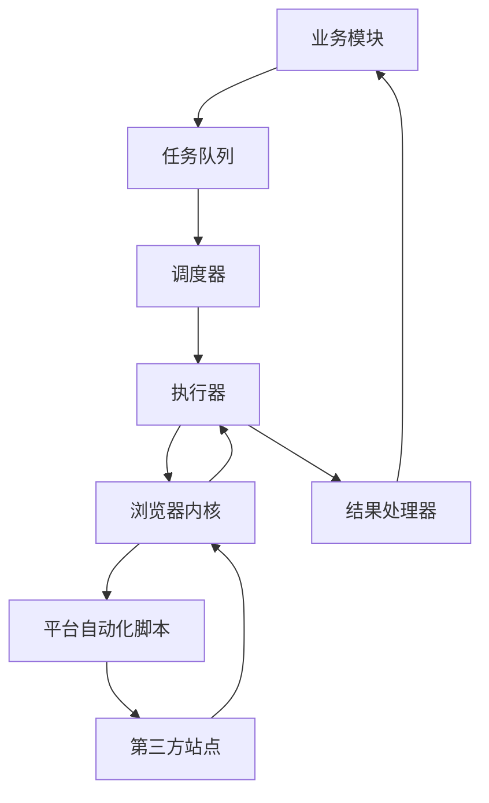

## 10.3 核心组件 Core Components
| 组件 Component | 职责 Responsibility |
|----------|----------------|
| Task Queue 任务队列 | 存储所有待执行自动化任务 |
| Scheduler 调度器 | 管控任务执行顺序、定时触发 |
| Executor 执行器 | 运行自动化任务主运行时 |
| Browser Engine 浏览器内核 | 封装Playwright浏览器操作 |
| State Machine 状态机 | 追踪任务全生命周期状态 |
| Script Engine 脚本引擎 | 执行各平台定制自动化步骤 |
| Result Handler 结果处理器 | 统一处理任务成功/失败结果 |

## 10.4 RPA任务完整生命周期 Task Lifecycle
每条自动化任务严格遵循状态流转：
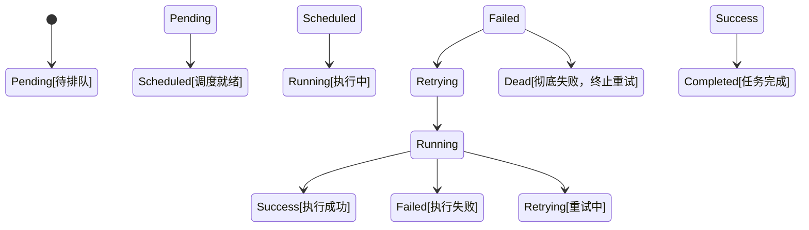

## 10.5 任务数据模型 Task Model
```ts
interface RPATask {
  id: string           // 任务唯一ID
  type: string         // 任务类型
  platform: string     // 目标执行平台
  payload: any          // 任务业务参数
  status: TaskStatus   // 当前状态
  retryCount: number   // 已重试次数
  createdAt: number    // 创建时间戳
}
```

## 10.6 任务执行规范 Execution Model
RPA任务执行约束：
- 单任务内部步骤串行执行（手动配置并行除外）
- 每条任务独立隔离浏览器会话
- 任务执行之间默认无共享内存状态（会话缓存除外）
- 失败任务支持多次自动重试

## 10.7 浏览器会话隔离规范 Browser Engine Isolation
每一条自动化任务会话强制隔离：
- 独立浏览器上下文运行
- 账号Cookie、本地存储完全隔离
- 杜绝多账号数据、登录态相互泄露
- 任务执行完成销毁浏览器实例（性能优化场景支持实例池复用）

## 10.8 自动化脚本体系 Script System
各平台自动化流程通过独立脚本实现：
```text
平台自动化脚本 = 一系列确定、可复现的浏览器操作步骤
```
标准执行流程示例：
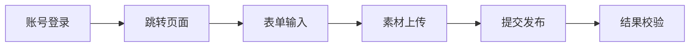

## 10.9 异常分类与处理策略 Error Handling Strategy
RPA引擎将错误分为五类，配套对应处理逻辑：
| 错误类型 Type | 说明 Description | 处理动作 Action |
|------|-------------|--------|
| NetworkError 网络异常 | 网络连接超时、接口访问失败 | 自动重试 |
| ScriptError 脚本逻辑异常 | 自动化步骤代码存在缺陷 | 终止任务/修复脚本后重试 |
| AuthError 鉴权异常 | 登录失效、会话过期 | 重新登录后重试 |
| PlatformChange 站点改版 | 第三方页面DOM结构变动 | 上报告警，人工适配脚本 |
| SystemError 系统内部故障 | 底层引擎异常崩溃 | 有限次数重试或直接失败 |

## 10.10 重试策略 Retry Strategy
RPA引擎完整支持：
- 指数退避重试间隔
- 单任务最大重试次数限制
- 重试过程状态持久化保存
- 多次失败后升级告警处理

## 10.11 RPA事件体系 Event Model
RPA引擎通过Core事件总线推送全生命周期事件：
- rpa.task.created 任务创建
- rpa.task.started 任务开始执行
- rpa.task.progress 执行进度更新
- rpa.task.success 任务执行成功
- rpa.task.failed 任务执行失败
- rpa.task.retrying 进入自动重试流程

## 10.12 安全约束 Security Constraints
RPA引擎运行规范：
- 全部浏览器运行在独立沙箱环境
- 禁止绕过权限直接读写本地文件
- 不与前端UI界面强耦合
- 不同账号登录态严格隔离
- 敏感自动化数据加密持久化存储

## 10.13 与平台层集成关系 Integration with Platform Layer
RPA引擎不直接和业务模块交互，完整链路：
业务模块 → 任务队列 → RPA引擎 → 平台自动化脚本 → 平台适配器（可选抽象层）

## 10.14 RPA架构总结 Architectural Summary
RPA引擎定位：
> 通过受控浏览器环境，执行标准化、可复现第三方平台工作流的确定性任务执行系统

保障效果：
- 自动化流程稳定、可重复执行
- 业务逻辑与浏览器操作完全解耦
- 完善故障容错与自动恢复能力
- 支持批量、大规模任务扩展

---

# 11. 数据分层架构 Data Architecture
数据架构定义YuMatrix Studio全局数据结构、存储、访问、隔离规则，保证业务模块、平台适配器、核心服务之间数据一致性、模块数据所有权隔离、持久化安全。

## 11.1 设计目标 Design Goals
数据层需达成：
- 每类数据归属唯一所有者模块
- 模块间无共享可变全局状态
- 统一标准化数据读写范式
- 多账号数据完全隔离，无泄露
- 持久化生命周期可预期、可控
- 运行时内存临时数据与持久化存储数据分层隔离

## 11.2 数据所有权原则 Data Ownership Principle
每一条数据实体仅归属一个业务模块，所有权不可交叉：
| 数据类型 Data Type | 归属模块 Owner Module |
|------------|-------------|
| Account 账号 | Account 账号模块 |
| Session 登录会话 | Account 账号模块 |
| PublishTask 发布任务 | Publish 发布模块 |
| MediaAsset 媒体素材记录 | Media 媒体模块 |
| AIRequest AI调用记录 | AI Hub AI调度中心 |
| RPAExecution 自动化执行记录 | RPA Engine RPA引擎 |
| AnalyticsRecord 统计数据 | Analytics 数据分析模块 |

## 11.3 强制数据访问规范 Data Access Rule
所有数据读写统一遵循固定链路：
```text
业务模块 → Repository仓储层 → Core数据库服务 → 底层存储引擎
```

### 禁止访问模式 Forbidden Access Patterns
❌ 前端渲染层直接操作数据库
❌ 平台适配器直连数据库
❌ RPA引擎直接读取其他模块内存状态
❌ AI Hub绕过仓储层直连业务数据表

## 11.4 数据流转架构 Data Flow Architecture
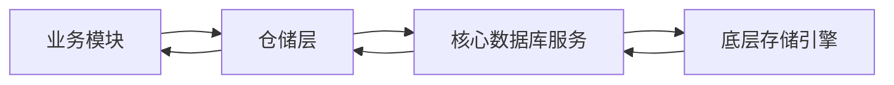

## 11.5 强制仓储层模式 Repository Pattern Requirement
所有业务模块必须封装独立仓储层，示例标准：
```ts
interface AccountRepository {
  createAccount(data: Account): Promise<void>
  getAccount(id: string): Promise<Account | null>
  updateAccount(id: string, data: Partial<Account>): Promise<void>
  deleteAccount(id: string): Promise<void>
}
```

## 11.6 多账号数据隔离模型 Multi-Account Isolation Model
不同账号数据存储完全隔离，互不互通：
```text
账号A
   ↓
会话A
   ↓
账号A专属业务数据

账号B
   ↓
会话B
   ↓
账号B专属业务数据
```
严格禁止跨账号数据读取、泄露。

## 11.7 运行时数据 vs 持久化数据 Runtime vs Persistent Data
### 运行时临时数据（断电丢失 Ephemeral）
- UI界面状态
- AI临时流式返回缓存
- RPA内存执行状态
- 内存运行时缓存

### 持久化数据（本地磁盘永久保存 Persistent Data）
- 账号配置信息
- 历史发布记录
- 媒体素材索引
- 数据分析报表
- 登录会话缓存

## 11.8 缓存使用规范 Caching Strategy
缓存仅允许在两层实现：
- Core 核心服务层
- Repository 仓储层

缓存禁止场景：
- 前端渲染层实现缓存逻辑
- 缓存覆盖持久化数据库真实数据
- 绕过仓储层直接读写缓存

## 11.9 数据一致性模型 Data Consistency Model
系统分层一致性策略：
> 跨模块分布式事件操作：最终一致性
> 账号、会话核心数据：强一致性

## 11.10 事件驱动数据更新 Event-Driven Data Updates
所有数据新增、修改操作必须抛出对应事件：
```text
account.created 账号新增
account.updated 账号更新
publish.created 创建发布任务
media.uploaded 素材上传完成
rpa.completed 自动化任务结束
```

## 11.11 备份与恢复机制 Backup & Recovery
数据层原生支持：
- 快照式全量备份
- 会话登录态恢复
- RPA任务中断重放
- 发布任务失败重试数据恢复

## 11.12 数据安全规则 Security Rules
敏感数据强制规范：
- 本地磁盘加密存储
- 按账号隔离加密分区
- 禁止原始敏感数据直接传递给前端渲染层
- 日志中禁止明文打印密钥、Cookie等隐私信息

## 11.13 数据架构总结 Architectural Summary
数据架构核心约束：
> 每一条数据拥有唯一归属模块、完整生命周期、标准化受控访问路径

保障效果：
- 无隐藏全局共享状态
- 模块间数据完全隔离，互不污染
- 系统运行行为可预期、稳定可控

---

# 12. 事件总线通信架构 Event Architecture
事件架构定义YuMatrix Studio全模块统一通信机制，是解耦业务模块、核心服务、平台适配器、RPA引擎的核心基础设施。

## 12.1 设计目标 Design Goals
事件总线体系目标：
- 模块之间低耦合、无硬编码依赖
- 完整支持异步通信
- 全系统运行状态可观测、可追踪
- 系统状态变更实时广播同步
- 事件历史可持久化，支持调试、任务恢复重放
- 高并发事件路由弹性扩展

## 12.2 事件驱动通用模型 Event-Driven Model
模块间通信优先使用事件，减少直接函数调用耦合：
```text
模块A → 全局事件总线 Event Bus → 模块B
```
同一业务域内可少量直接调用，跨域通信强制走事件总线。

## 12.3 事件总线整体架构 Event Bus Architecture
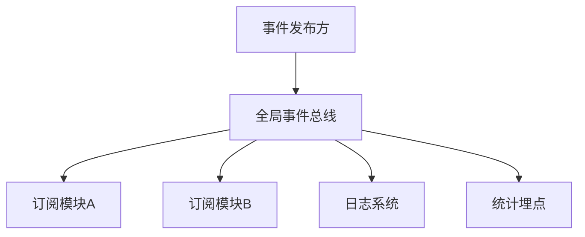

## 12.4 事件命名统一规范 Event Types
全部事件严格遵循三段式命名格式：
```text
<业务域>.<操作动作>.<状态结果>
```
示例：
- account.created 账号创建完成
- account.updated 账号信息更新
- publish.started 发布任务启动
- publish.completed 发布任务结束
- rpa.task.failed 自动化任务失败
- ai.response.generated AI内容生成完成
- platform.login.success 平台登录成功

## 12.5 事件载荷标准结构 Event Payload Standard
所有事件统一基础数据结构：
```ts
interface BaseEvent {
  id: string         // 事件唯一ID
  type: string       // 事件名称
  timestamp: number  // 事件发生时间戳
  source: string     // 事件来源模块标识
  payload: any       // 事件业务数据
}
```

## 12.6 事件完整流转模型 Event Flow Model
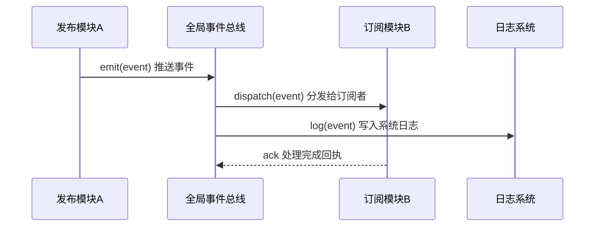

## 12.7 事件四大分类 Event Categories
### 1. 业务域事件 Domain Events
由上层业务逻辑触发：
- account.created 账号创建
- publish.completed 发布完成
- media.uploaded 素材上传成功

### 2. 系统底层事件 System Events
系统生命周期、底层异常触发：
- system.start 程序启动
- system.shutdown 程序关闭
- error.occurred 全局异常捕获

### 3. RPA自动化事件 RPA Events
自动化任务全流程：
- rpa.task.started 任务启动
- rpa.task.progress 执行进度更新
- rpa.task.failed 任务失败

### 4. AI智能事件 AI Events
AI调度中心相关行为：
- ai.request.sent AI请求发起
- ai.response.received AI返回内容
- ai.tool.executed AI工具函数调用完成

## 12.8 事件时序约束 Event Ordering Rules
- 同一业务域内事件严格按发生顺序分发
- 跨不同业务域事件不保证时序先后
- 关键业务流程必须自行实现幂等逻辑，兼容乱序

## 12.9 事件持久化规范 Event Persistence
事件可选择持久化存储，用于：
- 开发调试问题追溯
- 任务流程重放恢复
- 全链路操作审计日志
- 数据分析统计
事件持久化不能阻塞主程序运行，不影响实时性能。

## 12.10 事件重放恢复系统 Event Replay System
系统支持事件历史重放，用于：
- RPA自动化任务中断恢复
- 发布任务失败重试
- AI调用流程问题调试
重放操作不会修改原始事件历史记录。

## 12.11 事件安全规范 Event Security Rules
事件载荷禁止携带：
- 原始账号密钥、Cookie明文
- 完整登录会话敏感数据
- 未加密Token凭证
- 第三方平台私密密钥
敏感信息必须脱敏或加密传输。

## 12.12 事件总线强制约束 Event Bus Constraints
全局事件总线必须满足：
- 系统唯一事件分发中心
- 自动检测并阻断事件无限循环广播
- 高并发背压限流处理
- 避免同一事件重复分发至订阅者

## 12.13 事件架构总结 Architectural Summary
事件总线定位：
> YuMatrix Studio 全系统消息中枢（神经系统）

保障效果：
- 模块之间无直接硬依赖、低耦合
- 全系统运行状态完整可观测
- 业务工作流可追溯、支持中断重放恢复
- 系统复杂度提升时架构依然具备可扩展性

---

# 13. 依赖约束规范体系 Dependency Rules System
依赖规则体系定义YuMatrix Studio全局模块交互硬性边界，保障架构长期完整性、杜绝循环依赖、维持项目可维护性。

## 13.1 核心原则 Core Principle
项目全部依赖关系严格遵守：
> 单向分层依赖图
```text
上层分层 → 下层分层 仅允许向下引用
```
反向依赖一律禁止。

## 13.2 分层优先级从上至下 Layer Hierarchy
分层优先级顺序（上层只能引用下层）：
```text
Application 应用宿主层
↓
Business Modules 业务模块层
↓
Platform Adapter 平台适配器层
↓
Core Services 核心服务层
↓
Infrastructure 底层基础设施
```

## 13.3 依赖允许对照表 Allowed Dependency Matrix
| 引用方 From | 被引用方 To | 是否允许 Allowed |
|------|----|--------|
| 业务模块 Business Modules | 核心服务 Core Services | ✅ |
| 业务模块 Business Modules | 平台适配器 Platform Adapters | ✅ |
| 平台适配器 Platform Adapters | 核心服务 Core Services | ✅ |
| 核心服务 Core Services | 基础设施 Infrastructure | ✅ |
| 渲染层 Renderer | 业务模块 Business Modules（仅通过IPC跨进程） | ⚠️ 有限允许 |
| 渲染层 Renderer | 核心服务 Core Services | ❌ |
| 平台适配器 Platform | 其他平台适配器 Platform | ❌ |

## 13.4 严格禁止的依赖场景 Forbidden Dependency Rules
### ❌ UI渲染层违规
- 渲染层直接导入数据库操作
- 渲染层直接读写本地文件系统
- 渲染层调用RPA自动化引擎
- 渲染层直接实例化平台适配器

### ❌ 业务模块层违规
- 发布模块直接导入账号模块内部类
- AI Hub直接调用平台适配器
- 数据分析模块耦合RPA引擎
- 模块间直接共享内存状态

### ❌ 平台适配器违规
- A平台适配器导入B平台适配器
- 平台适配器直接调用前端UI
- 平台适配器读取业务模块内部逻辑

### ❌ 核心层违规
- Core核心服务导入任意业务模块
- Core导入渲染层Renderer
- Core导入平台适配器

核心层完全独立，不向上依赖任何上层业务代码。

## 13.5 循环依赖零容忍 Circular Dependency Rule
任何循环导入直接判定架构违规：
```text
A导入B → B导入C → C导入A ❌ 循环依赖
```
循环依赖检测执行时机：
- 项目编译构建阶段
- CI流水线自动化校验
- Lint代码静态检查

## 13.6 依赖约束落地手段 Dependency Enforcement Strategy
三层机制强制校验架构边界：
### 1. 静态代码分析 Static Analysis
- 自定义ESLint导入校验规则
- TypeScript路径导入限制
- 模块边界导入黑白名单校验

### 2. 构建时校验 Build-Time Validation
- 依赖关系图自动校验
- 循环依赖检测阻断打包
- 分层导入权限校验

### 3. 运行时防护 Runtime Safeguards
- Core核心服务访问隔离校验
- IPC跨进程通信边界拦截

## 13.7 模块导入规范 Module Import Rules
### 业务模块 Business Modules
仅允许导入：
- Core 全部核心服务
- 同模块内部工具类

禁止导入：
- 前端渲染层Renderer
- 其他平台适配器内部实现
- 其他业务模块内部类（跨模块交互走事件总线）

### 平台适配器 Platform Adapters
仅允许导入：
- Core 核心服务

禁止导入：
- 所有业务模块
- 渲染层UI
- 其他第三方平台适配器

### Core 核心服务 Core Services
禁止导入：
- 任意业务模块
- 任意平台适配器
- 前端渲染层

## 13.8 跨模块通信唯一标准 Communication Rule
所有跨模块数据交互仅两条合法路径：
```text
全局事件总线 Event Bus 或 跨进程IPC通信
```
跨模块边界直接函数导入调用不推荐、长期需逐步改造。

## 13.9 架构依赖完整流向图 Architectural Integrity Model
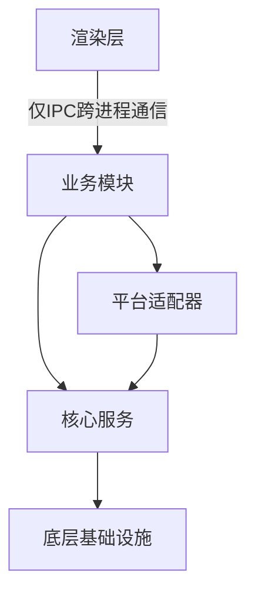
图中不允许出现任何反向箭头。

## 13.10 依赖违规处理机制 Dependency Failure Handling
检测到违规依赖执行流程：
1. 阻断项目CI构建，流水线失败
2. 完整日志输出违规模块、导入链路
3. 定位违规代码文件位置
4. 运行时尽可能拦截非法调用，抛出异常

## 13.11 依赖规范架构总结 Architectural Summary
依赖约束体系核心作用：
> 防止架构随迭代逐步腐化、边界模糊

保障效果：
- 项目长期可维护，分层清晰
- 代码依赖关系可预期、可管控
- 无隐藏跨模块耦合
- 安全横向扩展新增模块、平台

---

# 14. 版本迭代路线与演进策略 Roadmap & Evolution Strategy
本章定义YuMatrix Studio长期架构迭代演进思路，保证底层架构稳定的同时，持续扩展功能、重构优化、新增业务能力。

## 14.1 架构迭代核心理念 Architecture Philosophy of Evolution
YuMatrix Studio 遵循渐进式迭代原则：
> 增量迭代优化，拒绝一次性大规模重构重写

释义：
- 不进行全项目整体重写
- 无破坏性架构重构动作
- 持续分模块迭代优化
- 所有迭代保持向下兼容

## 14.2 迭代周期模型 Sprint-Based Development Model
项目按迭代周期有序演进：
```text
迭代周期 → 定向架构优化任务 → 稳定回归测试 → 下一迭代周期
```

## 14.3 整体迭代路线 Current Roadmap Overview
| 迭代周期 Sprint | 迭代目标 Goal |
|--------|------|
| Sprint 0 | 项目代码清理、目录结构标准化统一 |
| Sprint 1 | 搭建完整Core底层核心架构基座 |
| Sprint 2 | 数据库仓储层整体重构标准化 |
| Sprint 3 | IPC跨进程通信层稳定统一 |
| Sprint 4 | 所有平台适配器SDK标准化改造 |
| Sprint 5 | RPA自动化引擎稳定完善 |
| Sprint 6 | AI Hub调度中心性能、路由策略优化 |
| Sprint 7 | 全部业务模块分层解耦重构 |
| Sprint 8 | 前端渲染层架构清理、组件标准化 |
| Sprint 9 | 全项目自动化测试体系搭建完成 |
| Sprint 10 | 全系统性能瓶颈优化 |
| Sprint 11 | 第三方插件生态体系开发 |
| Sprint 12 | 正式生产发布配套体系 |

## 14.4 分层迭代演进策略 Evolution Strategy by Layer
### Core 核心层
Core在所有迭代周期保持稳定：
- 仅新增向下兼容接口、能力
- 绝对不写入任何业务逻辑

### Business Modules 业务模块层
业务模块迭代方式：
- 模块内部逻辑重构优化
- 对外公共API标准化稳定
- 逐步迁移至事件驱动通信
- 模块间持续解耦

### Platform Layer 平台适配器层
适配器迭代方向：
- 自动化脚本鲁棒性优化
- 适配站点改版提升容错
- 无侵入式新增第三方平台
存量适配器禁止破坏性修改。

### RPA Engine RPA自动化引擎
RPA迭代优化方向：
- 任务调度算法优化
- 故障恢复、重试逻辑完善
- 支持多任务并行执行
- Playwright浏览器内核升级适配

### AI Hub AI调度中心
AI中心迭代方向：
- 新增各类大模型服务商适配
- 智能路由分配策略持续优化
- 工具函数调用能力扩展
- 短期上下文记忆机制完善

## 14.5 版本号规范 Versioning Strategy
全部模块严格遵循语义化版本规范：
```text
主版本.次版本.补丁版本 MAJOR.MINOR.PATCH
```
版本变更规则：
- MAJOR 主版本：存在破坏性架构变更
- MINOR 次版本：新增功能、扩展能力
- PATCH 补丁版本：bug修复、细节优化

## 14.6 向下兼容强制规则 Backward Compatibility Rule
任何架构修改必须保障：
- 存量业务模块可正常运行
- 历史对外API接口保持可用
- 事件总线事件名称、载荷结构兼容

破坏性变更约束：
- 隔离至独立新版本分支
- 提供完整平滑迁移方案
- 架构决策记录ADR完整文档说明

## 14.7 架构不变防护约束 Architectural Guardrails
系统迭代全程强制遵守基础架构约束：
- 第13章全部依赖导入规则
- 事件总线通信契约长期稳定
- Core核心底层服务不发生破坏性变更
- 平台适配器完全隔离设计不变

## 14.8 架构腐化修复方案 Failure Recovery Strategy
迭代中出现架构边界混乱、违规依赖时修复流程：
1. 定位违规耦合的模块代码
2. 隔离反向依赖、循环依赖代码
3. 重构至正确分层边界（Core/业务模块/适配器）
4. 重新校验全局依赖关系图

## 14.9 未来扩展规划 Future Expansion Areas
本架构预留四大长期扩展方向：
### 1. 可视化工作流引擎 Workflow Engine
- 可视化拖拽自动化流程编辑器
- AI自动生成完整运营工作流

### 2. 插件市场体系 Plugin Marketplace
- 第三方开发者扩展插件
- 商业化插件生态
- 插件独立沙箱安全执行

### 3. 云端同步协作层 Cloud Sync Layer
- 多设备配置、任务云端同步
- 多人团队协同运营
- 远程云端任务执行节点

### 4. AI智能代理系统 AI Agent System
- 自主完成全链路运营任务
- 多智能代理协同调度
- 长期持续运行复杂工作流

## 14.10 架构最终远景 End State Vision
YuMatrix Studio长期演进目标：
> 面向数字运营工作的分布式AI+自动化操作系统

最终具备能力：
- AI自主生成全流程运营内容
- 一键多平台批量发布分发
- 自动化流程自修复、故障自愈
- 插件生态无限横向扩展能力

## 14.11 全文档架构总结 Final Summary
本套目标架构保障：
- 项目长期横向、纵向可扩展
- 系统复杂度可控、有序增长
- Core底层核心长期稳定不变
- 模块增量迭代、安全无风险扩展
- 原生深度集成AI能力，适配未来智能化运营需求