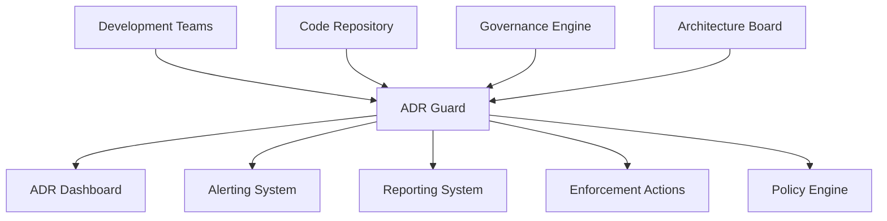

# ADR Guard Architecture

## 1. Overview

The ADR Guard is a specialized subsystem within the Governance Engine responsible for ensuring that all architectural decisions are properly documented, reviewed, and enforced. It provides automated validation and monitoring of Architectural Decision Records (ADRs) to maintain architectural integrity throughout the development lifecycle.

## 2. System Context

## 3. Core Components

### 3.1 ADR Validator
- **Responsibility**: Validate ADR format, content, and completeness
- **Functionality**:
  - ADR template compliance checking
  - Required field validation
  - Content quality assessment
  - Cross-reference validation
  - Metadata verification

### 3.2 ADR Monitor
- **Responsibility**: Track ADR lifecycle and implementation status
- **Functionality**:
  - ADR creation and modification tracking
  - Implementation status monitoring
  - Expiration and review date tracking
  - Impact assessment monitoring
  - Stakeholder engagement tracking

### 3.3 ADR Enforcer
- **Responsibility**: Ensure ADR compliance in code and processes
- **Functionality**:
  - Code pattern validation against ADR requirements
  - Process compliance checking
  - Automated remediation suggestions
  - Violation detection and reporting
  - Exception management

### 3.4 ADR Analyzer
- **Responsibility**: Analyze ADR effectiveness and identify improvements
- **Functionality**:
  - ADR impact analysis
  - Decision effectiveness evaluation
  - Pattern recognition across ADRs
  - Trend analysis and reporting
  - Recommendation generation

### 3.5 ADR Repository
- **Responsibility**: Store and manage ADR metadata and relationships
- **Functionality**:
  - ADR indexing and search
  - Relationship mapping
  - Version control integration
  - Metadata management
  - Access control and audit

## 4. Data Flow

### 4.1 Input Sources
1. **Code Repository**: Git repository for ADR detection and tracking
2. **ADR Files**: Markdown files containing architectural decisions
3. **Configuration Files**: ADR guard policies and rules
4. **User Input**: Manual reviews and exception requests
5. **External Systems**: Issue trackers and project management tools

### 4.2 Processing Pipeline
1. **ADR Discovery**: Identification and parsing of ADR files
2. **Validation Execution**: Running validation checks against ADRs
3. **Compliance Assessment**: Determining ADR compliance status
4. **Impact Analysis**: Assessing ADR implementation impact
5. **Action Determination**: Deciding on appropriate responses
6. **Result Distribution**: Sending results to appropriate systems

### 4.3 Output Destinations
1. **ADR Dashboard**: Real-time ADR status visualization
2. **Alerting System**: Notification of ADR issues and violations
3. **Reporting System**: Periodic ADR compliance reports
4. **Enforcement Actions**: Blocking, remediation, or escalation
5. **Audit Trail**: Logging of all ADR activities

## 5. Integration Points

### 5.1 Development Environment
- **IDE Plugins**: Real-time ADR validation and suggestions
- **Git Hooks**: Pre-commit and pre-push ADR validation
- **Local CLI Tools**: Command-line ADR management utilities
- **Editor Extensions**: Language-specific ADR support

### 5.2 CI/CD Pipeline
- **Build Validation**: ADR compliance checking during builds
- **Quality Gates**: ADR enforcement as deployment gates
- **Documentation Gates**: ADR completeness verification
- **Impact Analysis**: ADR change impact assessment

### 5.3 Repository Management
- **Pull Request Hooks**: Automated ADR review and validation
- **Branch Protection**: ADR compliance enforcement
- **Merge Blocking**: Prevention of changes without proper ADRs
- **Webhook Integration**: Real-time ADR monitoring

### 5.4 Governance Systems
- **Policy Engine**: ADR policy retrieval and interpretation
- **Enforcement Manager**: ADR compliance action execution
- **Reporting Service**: ADR data aggregation and reporting
- **Exception Manager**: ADR exception handling and monitoring

## 6. Technology Stack

### 6.1 Core Runtime
- **Node.js**: Primary runtime environment
- **TypeScript**: Type-safe implementation
- **Electron**: Desktop application integration

### 6.2 Analysis Tools
- **Markdown Parser**: ADR content parsing and validation
- **YAML/JSON Parser**: ADR metadata processing
- **Git Integration**: Repository interaction and history tracking
- **Custom Validators**: Organization-specific ADR validation logic

### 6.3 Data Storage
- **SQLite**: Local ADR metadata and relationship storage
- **In-memory Cache**: Real-time ADR state
- **File System**: ADR content and version history

### 6.4 Communication
- **IPC**: Inter-process communication with Electron
- **REST API**: External system integration
- **WebSockets**: Real-time dashboard updates

## 7. Security Considerations

### 7.1 Data Protection
- **Sensitive Data Handling**: Secure processing of ADR content
- **Access Control**: Role-based access to ADR functions
- **Audit Logging**: Comprehensive logging of all ADR activities
- **Data Minimization**: Collection only of necessary ADR data

### 7.2 System Integrity
- **Code Signing**: Verification of ADR guard components
- **Tamper Detection**: Monitoring for unauthorized modifications
- **Secure Communication**: Encrypted communication channels
- **Privilege Separation**: Isolation of ADR functions

### 7.3 ADR Security
- **Content Validation**: Sanitization of ADR content
- **Reference Verification**: Validation of external references
- **Metadata Protection**: Secure handling of ADR metadata
- **Version Control**: Secure ADR version management

## 8. Performance Requirements

### 8.1 Response Time
- **Real-time Validation**: < 500ms for simple ADR checks
- **Comprehensive Analysis**: < 5 seconds for full ADR validation
- **Dashboard Updates**: < 100ms for UI refresh
- **Batch Processing**: < 1 minute for repository-wide ADR analysis

### 8.2 Scalability
- **Concurrent Operations**: Support for multiple simultaneous ADR operations
- **Memory Usage**: < 500MB under normal operation
- **CPU Utilization**: < 50% during peak ADR processing periods
- **Repository Size**: Support for repositories with 1000+ ADRs

### 8.3 Availability
- **Uptime**: 99.9% availability target
- **Recovery Time**: < 30 seconds for automatic recovery
- **Degraded Mode**: Graceful degradation during system issues
- **Backup/Restore**: Automated backup and restore capabilities

## 9. Deployment Architecture

### 9.1 Local Development
- **Embedded Guard**: Lightweight version integrated with development tools
- **Offline Capability**: Functionality without network connectivity
- **Local Storage**: Caching of ADRs and validation rules
- **Incremental Analysis**: Fast analysis of changed ADRs only

### 9.2 CI/CD Integration
- **Pipeline Service**: Dedicated service for build validation
- **Docker Container**: Isolated execution environment
- **Resource Limits**: Controlled resource consumption
- **Caching**: Reuse of ADR analysis results when possible

### 9.3 Centralized Monitoring
- **Dashboard Service**: Web-based ADR monitoring
- **Alerting Service**: Notification and escalation system
- **Reporting Service**: Periodic ADR reporting
- **Audit Service**: Long-term storage of ADR data

## 10. Future Evolution

### 10.1 AI-Enhanced ADR Management
- **Pattern Recognition**: Machine learning for ADR pattern detection
- **Automated Recommendations**: Intelligent ADR suggestions
- **Impact Prediction**: Forecasting ADR implementation impact
- **Quality Assessment**: Automated ADR quality scoring

### 10.2 Cloud Integration
- **Centralized ADR Repository**: Cloud-based ADR management
- **Cross-Project ADRs**: Multi-repository ADR governance
- **Collaborative Review**: Team-based ADR review processes
- **Benchmarking**: Comparison with industry ADR practices

### 10.3 Advanced Analytics
- **Trend Analysis**: Long-term ADR trend identification
- **Effectiveness Metrics**: ADR decision outcome tracking
- **Process Optimization**: ADR workflow improvement recommendations
- **Risk Assessment**: Predictive risk modeling for ADRs

## 11. ADR Categories and Standards

### 11.1 Core Architecture ADRs
- **System Design**: Fundamental architectural decisions
- **Technology Stack**: Platform and tool selection
- **Integration Patterns**: System integration approaches
- **Data Management**: Data storage and processing decisions

### 11.2 Module and Component ADRs
- **Module Structure**: Component organization and boundaries
- **API Design**: Interface and contract decisions
- **Implementation Patterns**: Coding and design patterns
- **Dependency Management**: Library and framework usage

### 11.3 Process and Governance ADRs
- **Development Workflow**: Team processes and practices
- **Quality Assurance**: Testing and validation approaches
- **Deployment Strategy**: Release and deployment methods
- **Monitoring and Operations**: Observability and maintenance

### 11.4 Security and Compliance ADRs
- **Security Controls**: Authentication and authorization
- **Data Protection**: Privacy and encryption decisions
- **Compliance Requirements**: Regulatory and policy adherence
- **Risk Management**: Threat modeling and mitigation

## 12. ADR Lifecycle Management

### 12.1 ADR States
- **Proposed**: ADR under development and review
- **Accepted**: ADR approved and ready for implementation
- **Superseded**: ADR replaced by newer decision
- **Deprecated**: ADR no longer recommended
- **Rejected**: ADR not approved for implementation

### 12.2 Review Process
- **Initial Review**: Technical feasibility assessment
- **Stakeholder Review**: Input from affected teams
- **Architecture Board**: Final approval and decision
- **Implementation Tracking**: Monitoring of ADR adoption
- **Periodic Review**: Regular reassessment of decisions

### 12.3 Version Management
- **Semantic Versioning**: Major.Minor.Patch for ADR changes
- **Backward Compatibility**: Maintaining ADR consistency
- **Migration Paths**: Clear upgrade paths for ADR changes
- **Deprecation Notices**: Advance notice of ADR changes