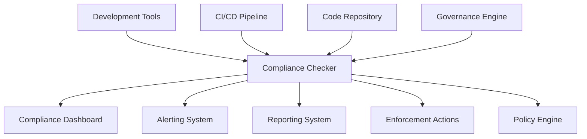

# Compliance Checker Architecture

## 1. Overview

The Compliance Checker is a specialized subsystem within the Governance Engine responsible for validating code, architecture, and processes against defined policies and standards. It provides real-time and batch compliance assessment capabilities to ensure adherence to YuMatrix Studio's architectural principles and development practices.

## 2. System Context

## 3. Core Components

### 3.1 Code Quality Analyzer
- **Responsibility**: Assess code quality against defined standards
- **Functionality**:
  - Static code analysis using ESLint and custom rules
  - Code complexity measurement and reporting
  - Code duplication detection and analysis
  - Best practices validation and suggestions
  - Technical debt identification and quantification

### 3.2 Architecture Validator
- **Responsibility**: Validate architectural compliance and boundaries
- **Functionality**:
  - Module dependency analysis using Dependency Cruiser
  - Layer violation detection and reporting
  - Circular dependency identification
  - Core service usage compliance checking
  - Platform adapter isolation validation

### 3.3 Security Scanner
- **Responsibility**: Identify security vulnerabilities and risks
- **Functionality**:
  - Dependency vulnerability scanning with Snyk
  - Hardcoded secret detection
  - Input validation and sanitization checking
  - Authentication and authorization validation
  - Data encryption and protection verification

### 3.4 Test Coverage Verifier
- **Responsibility**: Ensure adequate test coverage and quality
- **Functionality**:
  - Code coverage measurement and reporting
  - Test quality assessment and validation
  - Performance test requirement verification
  - Security test inclusion validation
  - Test documentation completeness checking

### 3.5 Documentation Validator
- **Responsibility**: Verify documentation completeness and quality
- **Functionality**:
  - API documentation completeness checking
  - Architecture decision record validation
  - User guide and README completeness
  - Code comment and inline documentation quality
  - Process documentation adherence verification

## 4. Data Flow

### 4.1 Input Sources
1. **Code Repository**: Git repository for code analysis
2. **Configuration Files**: Policy definitions and rule configurations
3. **Test Results**: Output from testing frameworks
4. **External Scanners**: Security and dependency scanning tools
5. **User Input**: Manual review and exception requests

### 4.2 Processing Pipeline
1. **Code Ingestion**: Collection and parsing of source code
2. **Policy Retrieval**: Fetching relevant policies and rules
3. **Analysis Execution**: Running appropriate validation checks
4. **Result Aggregation**: Combining results from all analyzers
5. **Compliance Assessment**: Determining overall compliance status
6. **Action Determination**: Deciding on appropriate responses

### 4.3 Output Destinations
1. **Compliance Dashboard**: Real-time status visualization
2. **Alerting System**: Notification of violations and issues
3. **Reporting System**: Periodic compliance reports
4. **Enforcement Actions**: Blocking, remediation, or escalation
5. **Audit Trail**: Logging of all compliance activities

## 5. Integration Points

### 5.1 Development Environment
- **IDE Plugins**: Real-time feedback during development
- **Git Hooks**: Pre-commit and pre-push validation
- **Local CLI Tools**: Command-line validation utilities
- **Editor Extensions**: Language-specific compliance checking

### 5.2 CI/CD Pipeline
- **Build Validation**: Gate checks in continuous integration
- **Quality Gates**: Test coverage and quality metric enforcement
- **Security Gates**: Vulnerability scanning and prevention
- **Deployment Gates**: Pre-deployment compliance verification

### 5.3 Repository Management
- **Pull Request Hooks**: Automated review and validation
- **Branch Protection**: Enforcement of compliance requirements
- **Merge Blocking**: Prevention of non-compliant changes
- **Webhook Integration**: Real-time compliance validation

### 5.4 Governance Systems
- **Policy Engine**: Policy retrieval and rule interpretation
- **Enforcement Manager**: Action execution and escalation
- **Reporting Service**: Compliance data aggregation
- **Exception Manager**: Exception handling and monitoring

## 6. Technology Stack

### 6.1 Core Runtime
- **Node.js**: Primary runtime environment
- **TypeScript**: Type-safe implementation
- **Electron**: Desktop application integration

### 6.2 Analysis Tools
- **ESLint**: Code quality validation
- **Dependency Cruiser**: Architecture compliance checking
- **Snyk**: Security vulnerability scanning
- **Jest/Istanbul**: Test coverage verification
- **Custom Analyzers**: Organization-specific validation logic

### 6.3 Data Storage
- **SQLite**: Local compliance data and audit logs
- **In-memory Cache**: Real-time compliance state
- **File System**: Policy definitions and rule sets

### 6.4 Communication
- **IPC**: Inter-process communication with Electron
- **REST API**: External system integration
- **WebSockets**: Real-time dashboard updates

## 7. Security Considerations

### 7.1 Data Protection
- **Sensitive Data Handling**: Secure processing of code and configuration
- **Access Control**: Role-based access to compliance functions
- **Audit Logging**: Comprehensive logging of all compliance activities
- **Data Minimization**: Collection only of necessary compliance data

### 7.2 System Integrity
- **Code Signing**: Verification of compliance checker components
- **Tamper Detection**: Monitoring for unauthorized modifications
- **Secure Communication**: Encrypted communication channels
- **Privilege Separation**: Isolation of compliance functions

### 7.3 Analysis Security
- **Sandboxed Execution**: Isolated execution of analysis tools
- **Resource Limiting**: Controlled resource consumption during analysis
- **Input Validation**: Sanitization of code and configuration inputs
- **Output Sanitization**: Secure handling of analysis results

## 8. Performance Requirements

### 8.1 Response Time
- **Real-time Validation**: < 1 second for simple checks
- **Comprehensive Analysis**: < 30 seconds for full repository scan
- **Dashboard Updates**: < 100ms for UI refresh
- **Batch Processing**: < 5 minutes for large repository analysis

### 8.2 Scalability
- **Concurrent Operations**: Support for multiple simultaneous analyses
- **Memory Usage**: < 1GB under normal operation
- **CPU Utilization**: < 80% during peak analysis periods
- **Repository Size**: Support for repositories up to 10GB

### 8.3 Availability
- **Uptime**: 99.9% availability target
- **Recovery Time**: < 30 seconds for automatic recovery
- **Degraded Mode**: Graceful degradation during system issues
- **Backup/Restore**: Automated backup and restore capabilities

## 9. Deployment Architecture

### 9.1 Local Development
- **Embedded Checker**: Lightweight version integrated with development tools
- **Offline Capability**: Functionality without network connectivity
- **Local Storage**: Caching of policies and previous analysis results
- **Incremental Analysis**: Fast analysis of changed files only

### 9.2 CI/CD Integration
- **Pipeline Service**: Dedicated service for build validation
- **Docker Container**: Isolated execution environment
- **Resource Limits**: Controlled resource consumption
- **Caching**: Reuse of analysis results when possible

### 9.3 Centralized Monitoring
- **Dashboard Service**: Web-based compliance monitoring
- **Alerting Service**: Notification and escalation system
- **Reporting Service**: Periodic compliance reporting
- **Audit Service**: Long-term storage of compliance data

## 10. Future Evolution

### 10.1 AI-Enhanced Analysis
- **Pattern Recognition**: Machine learning for violation pattern detection
- **Predictive Compliance**: Forecasting potential compliance issues
- **Automated Remediation**: Intelligent suggestion of fixes
- **Anomaly Detection**: Identification of unusual code patterns

### 10.2 Cloud Integration
- **Centralized Policies**: Cloud-based policy management
- **Cross-Project Compliance**: Multi-repository governance
- **Collaborative Analysis**: Team-based compliance review
- **Benchmarking**: Comparison with industry standards

### 10.3 Advanced Analytics
- **Trend Analysis**: Long-term compliance trend identification
- **Root Cause Analysis**: Automated identification of violation causes
- **Process Optimization**: Compliance process improvement recommendations
- **Risk Assessment**: Predictive risk modeling for compliance

## 11. Compliance Categories

### 11.1 Code Quality Compliance
- **Naming Conventions**: Variable, function, and class naming standards
- **Code Structure**: File organization and module structure
- **Complexity Metrics**: Cyclomatic complexity and maintainability
- **Best Practices**: Language-specific best practices adherence

### 11.2 Architecture Compliance
- **Module Boundaries**: Enforcement of module isolation
- **Layer Dependencies**: Validation of architectural layering
- **Core Service Usage**: Proper usage of core architectural components
- **Platform Adapter Compliance**: Adherence to platform standards

### 11.3 Security Compliance
- **Vulnerability Management**: Identification and remediation of vulnerabilities
- **Data Protection**: Proper handling of sensitive data
- **Access Control**: Implementation of authentication and authorization
- **Input Validation**: Prevention of injection and other attacks

### 11.4 Testing Compliance
- **Coverage Requirements**: Minimum test coverage thresholds
- **Test Quality**: Quality and effectiveness of tests
- **Performance Testing**: Inclusion of performance validation
- **Security Testing**: Security-focused test coverage

### 11.5 Documentation Compliance
- **API Documentation**: Completeness of API documentation
- **Architecture Documentation**: Accuracy of architecture records
- **User Documentation**: Quality of user-facing documentation
- **Process Documentation**: Completeness of process documentation