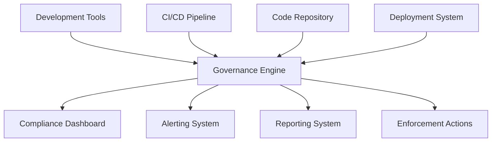

# Governance Engine Architecture

## 1. Overview

The Governance Engine is a core system component responsible for enforcing architectural principles, coding standards, and development practices across YuMatrix Studio. It operates as a centralized governance layer that monitors, validates, and enforces compliance throughout the development lifecycle.

## 2. System Context

## 3. Core Components

### 3.1 Policy Engine
- **Responsibility**: Interpret and execute governance policies
- **Functionality**: 
  - Parse policy definitions from configuration files
  - Evaluate policy conditions against system state
  - Trigger appropriate enforcement actions
  - Maintain policy versioning and lifecycle

### 3.2 Compliance Monitor
- **Responsibility**: Continuously monitor system for compliance
- **Functionality**:
  - Real-time scanning of code changes
  - Periodic assessment of architectural adherence
  - Security posture evaluation
  - Performance benchmark monitoring

### 3.3 Validation Service
- **Responsibility**: Execute validation checks against defined rules
- **Functionality**:
  - Static code analysis integration
  - Architecture dependency validation
  - Security vulnerability scanning
  - Test coverage verification

### 3.4 Enforcement Manager
- **Responsibility**: Execute enforcement actions based on validation results
- **Functionality**:
  - Block non-compliant changes from merging
  - Automatically remediate simple violations
  - Notify stakeholders of violations
  - Escalate critical issues to appropriate teams

### 3.5 Reporting Service
- **Responsibility**: Generate compliance reports and metrics
- **Functionality**:
  - Real-time compliance dashboards
  - Historical trend analysis
  - Executive summary reports
  - Audit trail generation

## 4. Data Flow

### 4.1 Input Sources
1. **Code Repository**: Git hooks and webhooks for change detection
2. **CI/CD Pipeline**: Build and test results
3. **Development Tools**: IDE plugins and local validation tools
4. **External Systems**: Security scanners, dependency checkers

### 4.2 Processing Pipeline
1. **Event Ingestion**: Collect events from all input sources
2. **Policy Evaluation**: Apply relevant policies to each event
3. **Validation Execution**: Run appropriate validation checks
4. **Action Determination**: Decide on enforcement actions
5. **Result Distribution**: Send results to appropriate systems

### 4.3 Output Destinations
1. **Compliance Dashboard**: Real-time status visualization
2. **Alerting System**: Notification of violations and issues
3. **Reporting System**: Periodic compliance reports
4. **Enforcement Actions**: Blocking, remediation, or escalation

## 5. Integration Points

### 5.1 Development Environment
- **IDE Plugins**: Real-time feedback during development
- **Git Hooks**: Pre-commit and pre-push validation
- **Local CLI Tools**: Command-line validation utilities

### 5.2 CI/CD Pipeline
- **Build Validation**: Gate checks in continuous integration
- **Deployment Gates**: Pre-deployment compliance verification
- **Quality Gates**: Test coverage and quality metric enforcement

### 5.3 Repository Management
- **Pull Request Hooks**: Automated review and validation
- **Branch Protection**: Enforcement of compliance requirements
- **Merge Blocking**: Prevention of non-compliant changes

### 5.4 Monitoring Systems
- **Observability Tools**: Integration with existing monitoring
- **Security Scanners**: Automated vulnerability detection
- **Performance Tools**: Benchmark and performance validation

## 6. Technology Stack

### 6.1 Core Runtime
- **Node.js**: Primary runtime environment
- **TypeScript**: Type-safe implementation
- **Electron**: Desktop application integration

### 6.2 Data Storage
- **SQLite**: Local policy and configuration storage
- **In-memory Cache**: Real-time compliance state
- **File System**: Policy definitions and rule sets

### 6.3 Communication
- **IPC**: Inter-process communication with Electron
- **REST API**: External system integration
- **WebSockets**: Real-time dashboard updates

### 6.4 External Tools
- **ESLint**: Code quality validation
- **Dependency Cruiser**: Architecture compliance checking
- **Snyk**: Security vulnerability scanning
- **Jest**: Test coverage verification

## 7. Security Considerations

### 7.1 Data Protection
- **Policy Encryption**: Encryption of sensitive policy configurations
- **Access Control**: Role-based access to governance functions
- **Audit Logging**: Comprehensive logging of all governance actions
- **Data Minimization**: Collection only of necessary compliance data

### 7.2 System Integrity
- **Code Signing**: Verification of governance engine components
- **Tamper Detection**: Monitoring for unauthorized modifications
- **Secure Communication**: Encrypted communication channels
- **Privilege Separation**: Isolation of governance functions

## 8. Performance Requirements

### 8.1 Response Time
- **Real-time Validation**: < 1 second for simple checks
- **Comprehensive Analysis**: < 10 seconds for complex validations
- **Dashboard Updates**: < 100ms for UI refresh

### 8.2 Scalability
- **Concurrent Operations**: Support for multiple simultaneous validations
- **Memory Usage**: < 500MB under normal operation
- **CPU Utilization**: < 50% during peak validation periods

### 8.3 Availability
- **Uptime**: 99.9% availability target
- **Recovery Time**: < 30 seconds for automatic recovery
- **Degraded Mode**: Graceful degradation during system issues

## 9. Deployment Architecture

### 9.1 Local Development
- **Embedded Engine**: Lightweight version integrated with development tools
- **Offline Capability**: Functionality without network connectivity
- **Local Storage**: Caching of policies and configurations

### 9.2 CI/CD Integration
- **Pipeline Service**: Dedicated service for build validation
- **Docker Container**: Isolated execution environment
- **Resource Limits**: Controlled resource consumption

### 9.3 Centralized Monitoring
- **Dashboard Service**: Web-based compliance monitoring
- **Alerting Service**: Notification and escalation system
- **Reporting Service**: Periodic compliance reporting

## 10. Future Evolution

### 10.1 AI-Enhanced Governance
- **Pattern Recognition**: Machine learning for violation pattern detection
- **Predictive Compliance**: Forecasting potential compliance issues
- **Automated Remediation**: Intelligent suggestion of fixes

### 10.2 Cloud Integration
- **Centralized Policies**: Cloud-based policy management
- **Cross-Project Compliance**: Multi-repository governance
- **Collaborative Governance**: Team-based policy development

### 10.3 Advanced Analytics
- **Trend Analysis**: Long-term compliance trend identification
- **Root Cause Analysis**: Automated identification of violation causes
- **Process Optimization**: Governance process improvement recommendations