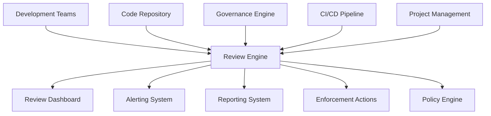

# Review Engine Architecture

## 1. Overview

The Review Engine is a specialized subsystem within the Governance Engine responsible for automating and enhancing the code review process. It provides intelligent review capabilities, automated feedback generation, and comprehensive review metrics to ensure code quality and consistency throughout the development lifecycle.

## 2. System Context

## 3. Core Components

### 3.1 Review Analyzer
- **Responsibility**: Analyze code changes and generate review feedback
- **Functionality**:
  - Code change detection and parsing
  - Pattern recognition and anomaly detection
  - Best practices validation
  - Security vulnerability identification
  - Performance optimization suggestions

### 3.2 Review Coordinator
- **Responsibility**: Manage review workflow and coordination
- **Functionality**:
  - Review assignment and scheduling
  - Reviewer selection and notification
  - Review status tracking
  - Deadline management
  - Escalation handling

### 3.3 Feedback Generator
- **Responsibility**: Generate intelligent review feedback
- **Functionality**:
  - Automated comment generation
  - Suggestion provision
  - Code example generation
  - Documentation linking
  - Remediation guidance

### 3.4 Review Metrics Collector
- **Responsibility**: Collect and analyze review metrics
- **Functionality**:
  - Review quality metrics collection
  - Reviewer performance tracking
  - Review cycle time measurement
  - Feedback effectiveness analysis
  - Trend identification

### 3.5 Review Repository
- **Responsibility**: Store and manage review data and metadata
- **Functionality**:
  - Review history storage
  - Feedback categorization
  - Reviewer expertise tracking
  - Performance metrics storage
  - Access control and audit

## 4. Data Flow

### 4.1 Input Sources
1. **Code Repository**: Git repository for code change detection
2. **Pull Requests**: PR creation and update events
3. **Code Changes**: Diff and file content analysis
4. **Configuration Files**: Review engine policies and rules
5. **User Input**: Manual reviews and exception requests

### 4.2 Processing Pipeline
1. **Change Detection**: Identification and parsing of code changes
2. **Analysis Execution**: Running appropriate review analysis
3. **Feedback Generation**: Creating review comments and suggestions
4. **Review Assignment**: Determining appropriate reviewers
5. **Notification Dispatch**: Sending review notifications
6. **Result Distribution**: Sending results to appropriate systems

### 4.3 Output Destinations
1. **Review Dashboard**: Real-time review status visualization
2. **Alerting System**: Notification of review issues and violations
3. **Reporting System**: Periodic review metrics reports
4. **Code Repository**: Automated review comments and suggestions
5. **Audit Trail**: Logging of all review activities

## 5. Integration Points

### 5.1 Development Environment
- **IDE Plugins**: Real-time review feedback in editors
- **Git Hooks**: Pre-commit and pre-push review validation
- **Local CLI Tools**: Command-line review management utilities
- **Editor Extensions**: Language-specific review support

### 5.2 CI/CD Pipeline
- **Build Integration**: Review validation during builds
- **Quality Gates**: Review compliance enforcement as deployment gates
- **Automated Review**: Integration with automated code analysis
- **Metrics Collection**: Review performance data collection

### 5.3 Repository Management
- **Pull Request Hooks**: Automated review feedback during pull requests
- **Review Requirements**: Review compliance enforcement
- **Merge Blocking**: Prevention of non-reviewed changes
- **Webhook Integration**: Real-time review monitoring

### 5.4 Project Management
- **Issue Tracker Integration**: Review synchronization with tasks
- **Status Updates**: Automatic review status reporting
- **Assignment Tracking**: Review responsibility management
- **Timeline Monitoring**: Review deadline enforcement

## 6. Technology Stack

### 6.1 Core Runtime
- **Node.js**: Primary runtime environment
- **TypeScript**: Type-safe implementation
- **Electron**: Desktop application integration

### 6.2 Analysis Tools
- **Git Integration**: Repository interaction and diff analysis
- **ESLint Integration**: Code quality analysis
- **Dependency Cruiser**: Architecture compliance checking
- **Snyk Integration**: Security vulnerability scanning
- **Custom Analyzers**: Organization-specific review logic

### 6.3 Data Storage
- **SQLite**: Local review metadata and metrics storage
- **In-memory Cache**: Real-time review state
- **File System**: Review history and configuration

### 6.4 Communication
- **IPC**: Inter-process communication with Electron
- **REST API**: External system integration
- **WebSockets**: Real-time dashboard updates
- **Message Queues**: Asynchronous review event processing

## 7. Security Considerations

### 7.1 Data Protection
- **Sensitive Data Handling**: Secure processing of code and review data
- **Access Control**: Role-based access to review functions
- **Audit Logging**: Comprehensive logging of all review activities
- **Data Minimization**: Collection only of necessary review data

### 7.2 System Integrity
- **Code Signing**: Verification of review engine components
- **Tamper Detection**: Monitoring for unauthorized modifications
- **Secure Communication**: Encrypted communication channels
- **Privilege Separation**: Isolation of review functions

### 7.3 Review Security
- **Content Validation**: Sanitization of review comments and feedback
- **Reference Verification**: Validation of external review references
- **Metadata Protection**: Secure handling of review metadata
- **Version Control**: Secure review version management

## 8. Performance Requirements

### 8.1 Response Time
- **Real-time Analysis**: < 500ms for simple code change analysis
- **Comprehensive Review**: < 10 seconds for full code review
- **Dashboard Updates**: < 100ms for UI refresh
- **Batch Processing**: < 1 minute for repository-wide review analysis

### 8.2 Scalability
- **Concurrent Operations**: Support for multiple simultaneous review operations
- **Memory Usage**: < 500MB under normal operation
- **CPU Utilization**: < 60% during peak review processing periods
- **Repository Size**: Support for repositories with 10000+ files

### 8.3 Availability
- **Uptime**: 99.9% availability target
- **Recovery Time**: < 30 seconds for automatic recovery
- **Degraded Mode**: Graceful degradation during system issues
- **Backup/Restore**: Automated backup and restore capabilities

## 9. Deployment Architecture

### 9.1 Local Development
- **Embedded Engine**: Lightweight version integrated with development tools
- **Offline Capability**: Functionality without network connectivity
- **Local Storage**: Caching of review rules and analysis results
- **Incremental Analysis**: Fast analysis of changed code only

### 9.2 CI/CD Integration
- **Pipeline Service**: Dedicated service for build review
- **Docker Container**: Isolated execution environment
- **Resource Limits**: Controlled resource consumption
- **Caching**: Reuse of review analysis results when possible

### 9.3 Centralized Monitoring
- **Dashboard Service**: Web-based review monitoring
- **Alerting Service**: Notification and escalation system
- **Reporting Service**: Periodic review reporting
- **Audit Service**: Long-term storage of review data

## 10. Future Evolution

### 10.1 AI-Enhanced Review Management
- **Pattern Recognition**: Machine learning for code pattern detection
- **Automated Recommendations**: Intelligent review suggestions
- **Performance Prediction**: Forecasting review effectiveness
- **Quality Assessment**: Automated code quality scoring

### 10.2 Cloud Integration
- **Centralized Review Repository**: Cloud-based review management
- **Cross-Project Reviews**: Multi-repository review governance
- **Collaborative Review**: Team-based review processes
- **Benchmarking**: Comparison with industry review practices

### 10.3 Advanced Analytics
- **Trend Analysis**: Long-term review trend identification
- **Effectiveness Metrics**: Review outcome tracking
- **Process Optimization**: Review improvement recommendations
- **Risk Assessment**: Predictive risk modeling for code changes

## 11. Review Categories and Standards

### 11.1 Code Quality Reviews
- **Style Compliance**: Adherence to coding standards
- **Best Practices**: Implementation of industry best practices
- **Readability**: Code clarity and maintainability
- **Complexity**: Cyclomatic complexity and maintainability index
- **Duplication**: Code duplication detection and elimination

### 11.2 Architecture Reviews
- **Layer Compliance**: Adherence to architectural layers
- **Module Boundaries**: Proper module isolation
- **Dependency Management**: Correct dependency usage
- **Interface Design**: Quality of API and interface design
- **Extensibility**: Design for future enhancements

### 11.3 Security Reviews
- **Vulnerability Detection**: Identification of security flaws
- **Input Validation**: Proper input sanitization
- **Authentication**: Secure authentication mechanisms
- **Authorization**: Proper access control implementation
- **Data Protection**: Secure data handling and storage

### 11.4 Performance Reviews
- **Efficiency**: Algorithmic and resource efficiency
- **Scalability**: Design for handling increased load
- **Optimization**: Performance optimization opportunities
- **Resource Usage**: Memory and CPU utilization
- **Caching**: Effective caching strategies

### 11.5 Testability Reviews
- **Test Coverage**: Adequate test coverage levels
- **Test Quality**: Quality of test implementation
- **Mocking**: Proper use of test doubles
- **Isolation**: Test isolation and independence
- **Maintainability**: Test code maintainability

## 12. Review Lifecycle Management

### 12.1 Review States
- **Pending**: Review request created but not started
- **In Progress**: Review currently being performed
- **Completed**: Review finished with feedback provided
- **Approved**: Review approved and ready for merge
- **Rejected**: Review rejected with required changes

### 12.2 Review Types
- **Automated**: Generated by automated analysis tools
- **Manual**: Performed by human reviewers
- **Hybrid**: Combination of automated and manual review
- **Peer**: Review by team members
- **Architectural**: Review by architecture team

### 12.3 Review Levels
- **Basic**: Initial code quality checks
- **Standard**: Comprehensive review including security
- **Advanced**: In-depth analysis with performance review
- **Expert**: Specialized review by domain experts
- **Executive**: High-level strategic review