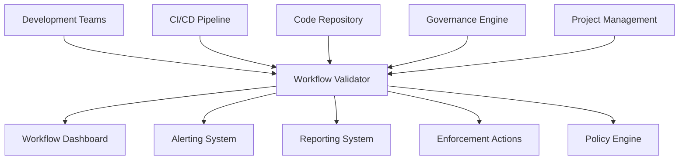

# Workflow Validator Architecture

## 1. Overview

The Workflow Validator is a specialized subsystem within the Governance Engine responsible for ensuring that development workflows, processes, and practices comply with defined standards and best practices. It provides automated validation and monitoring of workflow adherence to maintain process integrity and quality throughout the development lifecycle.

## 2. System Context

## 3. Core Components

### 3.1 Workflow Definition Manager
- **Responsibility**: Manage workflow definitions and templates
- **Functionality**:
  - Workflow template storage and versioning
  - Custom workflow definition support
  - Workflow metadata management
  - Template validation and linting

### 3.2 Workflow Execution Monitor
- **Responsibility**: Track and validate workflow execution
- **Functionality**:
  - Real-time workflow execution tracking
  - Step-by-step validation during execution
  - Branch and merge workflow monitoring
  - Parallel workflow coordination

### 3.3 Process Compliance Validator
- **Responsibility**: Validate adherence to process standards
- **Functionality**:
  - Code review process validation
  - Branch naming convention enforcement
  - Commit message standard compliance
  - Pull request workflow verification

### 3.4 Workflow Analyzer
- **Responsibility**: Analyze workflow effectiveness and identify improvements
- **Functionality**:
  - Workflow performance analysis
  - Bottleneck identification
  - Efficiency metrics calculation
  - Improvement recommendation generation

### 3.5 Workflow Repository
- **Responsibility**: Store and manage workflow metadata and relationships
- **Functionality**:
  - Workflow indexing and search
  - Execution history tracking
  - Performance metrics storage
  - Access control and audit

## 4. Data Flow

### 4.1 Input Sources
1. **Code Repository**: Git repository for workflow detection and tracking
2. **CI/CD Pipeline**: Build and deployment pipeline events
3. **Project Management**: Issue tracker and task management systems
4. **Configuration Files**: Workflow validator policies and rules
5. **User Input**: Manual reviews and exception requests

### 4.2 Processing Pipeline
1. **Workflow Discovery**: Identification and parsing of workflow definitions
2. **Execution Tracking**: Monitoring of workflow execution in real-time
3. **Compliance Assessment**: Determining workflow compliance status
4. **Performance Analysis**: Assessing workflow efficiency and effectiveness
5. **Action Determination**: Deciding on appropriate responses
6. **Result Distribution**: Sending results to appropriate systems

### 4.3 Output Destinations
1. **Workflow Dashboard**: Real-time workflow status visualization
2. **Alerting System**: Notification of workflow issues and violations
3. **Reporting System**: Periodic workflow compliance reports
4. **Enforcement Actions**: Blocking, remediation, or escalation
5. **Audit Trail**: Logging of all workflow activities

## 5. Integration Points

### 5.1 Development Environment
- **IDE Plugins**: Real-time workflow validation and suggestions
- **Git Hooks**: Pre-commit and pre-push workflow validation
- **Local CLI Tools**: Command-line workflow management utilities
- **Editor Extensions**: Language-specific workflow support

### 5.2 CI/CD Pipeline
- **Build Validation**: Workflow compliance checking during builds
- **Quality Gates**: Workflow enforcement as deployment gates
- **Process Gates**: Workflow step validation
- **Metrics Collection**: Workflow performance data collection

### 5.3 Repository Management
- **Pull Request Hooks**: Automated workflow review and validation
- **Branch Protection**: Workflow compliance enforcement
- **Merge Blocking**: Prevention of workflow violations
- **Webhook Integration**: Real-time workflow monitoring

### 5.4 Project Management
- **Issue Tracker Integration**: Workflow synchronization with tasks
- **Status Updates**: Automatic workflow status reporting
- **Assignment Tracking**: Workflow responsibility management
- **Timeline Monitoring**: Workflow deadline enforcement

## 6. Technology Stack

### 6.1 Core Runtime
- **Node.js**: Primary runtime environment
- **TypeScript**: Type-safe implementation
- **Electron**: Desktop application integration

### 6.2 Analysis Tools
- **Git Integration**: Repository interaction and history tracking
- **YAML/JSON Parser**: Workflow definition processing
- **Event Processing**: Real-time workflow event handling
- **Custom Validators**: Organization-specific workflow validation logic

### 6.3 Data Storage
- **SQLite**: Local workflow metadata and performance storage
- **In-memory Cache**: Real-time workflow state
- **File System**: Workflow definitions and version history

### 6.4 Communication
- **IPC**: Inter-process communication with Electron
- **REST API**: External system integration
- **WebSockets**: Real-time dashboard updates
- **Message Queues**: Asynchronous workflow event processing

## 7. Security Considerations

### 7.1 Data Protection
- **Sensitive Data Handling**: Secure processing of workflow data
- **Access Control**: Role-based access to workflow functions
- **Audit Logging**: Comprehensive logging of all workflow activities
- **Data Minimization**: Collection only of necessary workflow data

### 7.2 System Integrity
- **Code Signing**: Verification of workflow validator components
- **Tamper Detection**: Monitoring for unauthorized modifications
- **Secure Communication**: Encrypted communication channels
- **Privilege Separation**: Isolation of workflow functions

### 7.3 Workflow Security
- **Content Validation**: Sanitization of workflow definitions
- **Reference Verification**: Validation of external workflow references
- **Metadata Protection**: Secure handling of workflow metadata
- **Version Control**: Secure workflow version management

## 8. Performance Requirements

### 8.1 Response Time
- **Real-time Validation**: < 200ms for simple workflow checks
- **Comprehensive Analysis**: < 2 seconds for full workflow validation
- **Dashboard Updates**: < 100ms for UI refresh
- **Batch Processing**: < 30 seconds for repository-wide workflow analysis

### 8.2 Scalability
- **Concurrent Operations**: Support for multiple simultaneous workflow operations
- **Memory Usage**: < 300MB under normal operation
- **CPU Utilization**: < 40% during peak workflow processing periods
- **Repository Size**: Support for repositories with 1000+ workflows

### 8.3 Availability
- **Uptime**: 99.9% availability target
- **Recovery Time**: < 30 seconds for automatic recovery
- **Degraded Mode**: Graceful degradation during system issues
- **Backup/Restore**: Automated backup and restore capabilities

## 9. Deployment Architecture

### 9.1 Local Development
- **Embedded Validator**: Lightweight version integrated with development tools
- **Offline Capability**: Functionality without network connectivity
- **Local Storage**: Caching of workflows and validation rules
- **Incremental Analysis**: Fast analysis of changed workflows only

### 9.2 CI/CD Integration
- **Pipeline Service**: Dedicated service for build validation
- **Docker Container**: Isolated execution environment
- **Resource Limits**: Controlled resource consumption
- **Caching**: Reuse of workflow analysis results when possible

### 9.3 Centralized Monitoring
- **Dashboard Service**: Web-based workflow monitoring
- **Alerting Service**: Notification and escalation system
- **Reporting Service**: Periodic workflow reporting
- **Audit Service**: Long-term storage of workflow data

## 10. Future Evolution

### 10.1 AI-Enhanced Workflow Management
- **Pattern Recognition**: Machine learning for workflow pattern detection
- **Automated Recommendations**: Intelligent workflow suggestions
- **Performance Prediction**: Forecasting workflow execution performance
- **Quality Assessment**: Automated workflow quality scoring

### 10.2 Cloud Integration
- **Centralized Workflow Repository**: Cloud-based workflow management
- **Cross-Project Workflows**: Multi-repository workflow governance
- **Collaborative Review**: Team-based workflow review processes
- **Benchmarking**: Comparison with industry workflow practices

### 10.3 Advanced Analytics
- **Trend Analysis**: Long-term workflow trend identification
- **Effectiveness Metrics**: Workflow outcome tracking
- **Process Optimization**: Workflow improvement recommendations
- **Risk Assessment**: Predictive risk modeling for workflows

## 11. Workflow Categories and Standards

### 11.1 Development Workflow Categories
- **Feature Development**: New feature implementation processes
- **Bug Fixing**: Issue resolution and bug fixing workflows
- **Code Review**: Peer review and approval processes
- **Release Management**: Versioning and deployment workflows
- **Hotfix**: Emergency fix and deployment processes

### 11.2 Process Compliance Categories
- **Branch Management**: Branch creation, usage, and cleanup
- **Commit Standards**: Commit message format and content
- **Pull Request Process**: PR creation, review, and merge
- **Testing Requirements**: Test coverage and quality gates
- **Documentation Updates**: Documentation maintenance workflows

### 11.3 Quality Assurance Workflows
- **Code Quality**: Static analysis and quality checks
- **Security Scanning**: Vulnerability detection and prevention
- **Performance Testing**: Performance validation workflows
- **Integration Testing**: Cross-component validation
- **User Acceptance**: User validation and approval

### 11.4 Collaboration Workflows
- **Task Assignment**: Work distribution and tracking
- **Status Updates**: Progress reporting and communication
- **Review Cycles**: Iterative review and refinement
- **Approval Chains**: Multi-level approval processes
- **Knowledge Sharing**: Documentation and learning workflows

## 12. Workflow Lifecycle Management

### 12.1 Workflow States
- **Defined**: Workflow template created and validated
- **Active**: Workflow currently in use
- **Suspended**: Workflow temporarily paused
- **Deprecated**: Workflow no longer recommended
- **Archived**: Workflow retired and stored for reference

### 12.2 Execution States
- **Pending**: Workflow execution queued
- **Running**: Workflow currently executing
- **Completed**: Workflow finished successfully
- **Failed**: Workflow execution failed
- **Cancelled**: Workflow execution cancelled

### 12.3 Version Management
- **Semantic Versioning**: Major.Minor.Patch for workflow changes
- **Backward Compatibility**: Maintaining workflow consistency
- **Migration Paths**: Clear upgrade paths for workflow changes
- **Deprecation Notices**: Advance notice of workflow changes